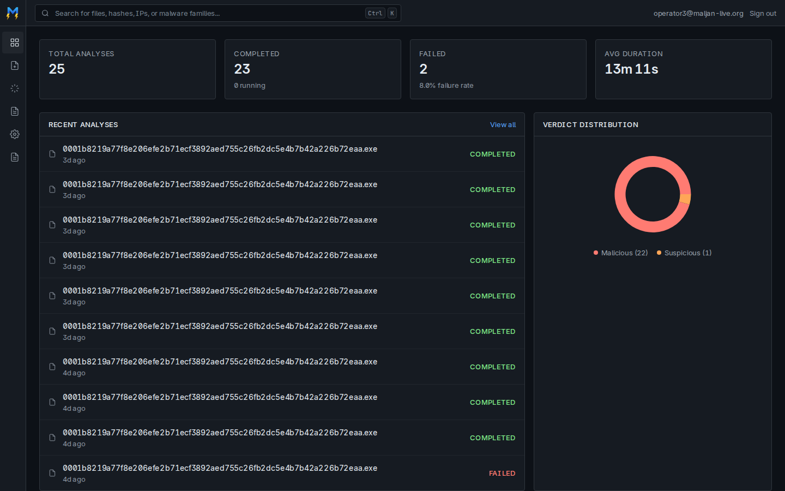
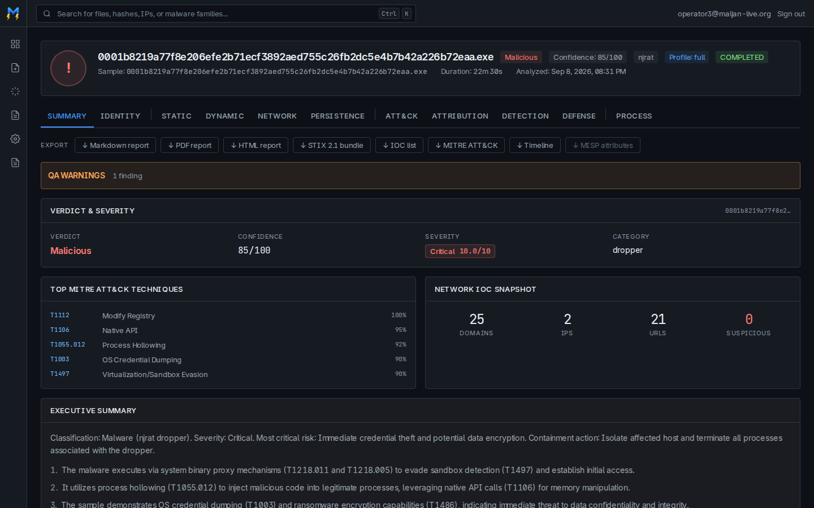
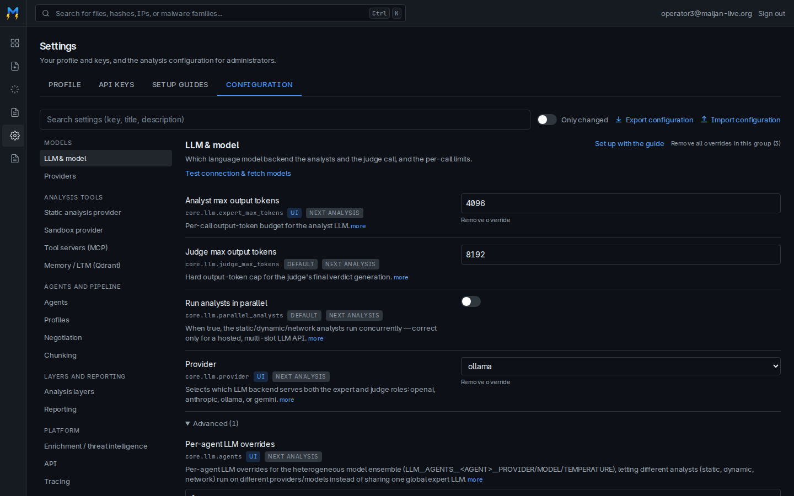
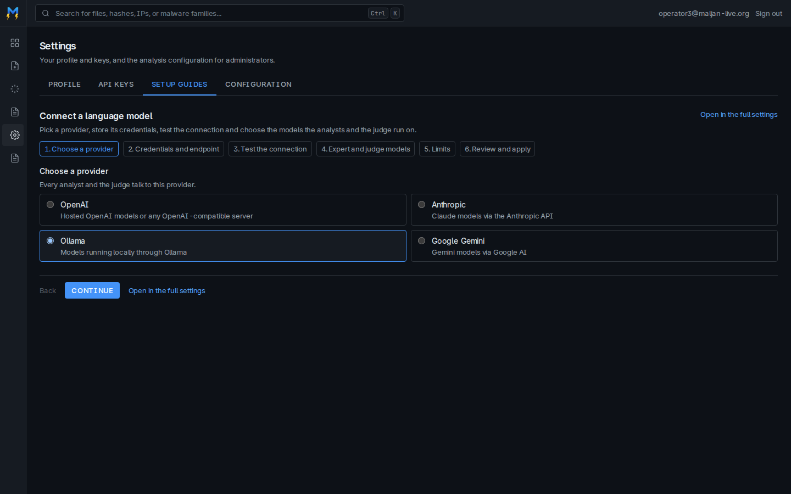

<p align="center">
  
</p>

<h1 align="center">Maljan</h1>
<p align="center"><em>Multi-Agent Malware Analysis Framework</em></p>

[](https://github.com/Root0ne/Maljan/actions/workflows/ci.yml)
[](https://github.com/Root0ne/Maljan/actions/workflows/codeql.yml)
[](https://scorecard.dev/viewer/?uri=github.com/Root0ne/Maljan)
[](https://www.python.org/)
[](LICENSE)

Maljan maps evidence about a Windows PE sample to MITRE ATT&CK technique
identifiers and emits a STIX 2.1 bundle. It is mostly not a language model: six
deterministic evidence layers assert techniques from signatures and rules, three
LLM analysts describe behaviour over three channels of evidence, a judge
synthesises a verdict, and a deterministic reconciliation and gating stage
decides what the analyst actually receives. The organising rule is that the
model proposes and code disposes: **the model never emits a technique identifier
or a final set.** Samples are submitted, tracked and read in a web console; the
whole configuration of a deployment lives in that console as well, not in
environment files.

## The console

| | |
|---|---|
|  |  |
| **Dashboard.** Totals, failure rate, recent analyses and verdict distribution. | **Analysis.** One run across nineteen sub-pages, with Markdown, PDF, HTML, STIX 2.1 and MISP export. |
|  |  |
| **Configuration.** Every application setting, grouped, searchable, with its origin and when a change takes effect. | **Setup guides.** Short walkthroughs that configure one subsystem at a time and test the connection before saving. |

## Quick start

The compose stack is the supported way to run Maljan. It needs Docker with the
Compose plugin, and `make setup` once to fetch the third-party trees the
`ghidra-mcp` image is built from.

```bash
git clone https://github.com/Root0ne/Maljan.git && cd Maljan
make setup                          # dependencies, pre-commit, external/
cp docker/.env.example docker/.env  # then fill in every secret it declares
make dev-up                         # docker compose up -d, development overlay
```

The development overlay is for a workstation; [docs/deployment.md](docs/deployment.md)
covers a production deployment.

Every secret in [`docker/.env.example`](docker/.env.example) is declared with
`:?` in the compose file, so the stack refuses to start while one is missing;
[docs/getting-started.md](docs/getting-started.md) has the commands that
generate them. Open <http://localhost:3000>, register the first account from
the login page, promote it to `admin` once in the database, then walk
**Settings → Setup** to point the deployment at a language model, a sandbox and
the rest. A fresh deployment starts on catalog defaults that are
`localhost`-shaped, so that pass is not optional.

The API serves its OpenAPI schema and `/docs` only when `DEBUG` is true; a
production deployment has no interactive schema.

## Documentation

Everything below lives in [docs/](docs/README.md) and is written against the
code in this repository.

| Document | What it covers |
| :-- | :-- |
| [getting-started.md](docs/getting-started.md) | Prerequisites, the two configuration files, starting the stack, first login and first analysis. |
| [configuration.md](docs/configuration.md) | The bootstrap environment contract, Settings → Configuration, the setup guides, connection probes, JSON export and import, secret storage. |
| [architecture.md](docs/architecture.md) | Components, the request and job lifecycle, agents and profiles, providers, memory and reporting. |
| [deployment.md](docs/deployment.md) | Compose services and healthchecks, required secrets, health endpoints, Kubernetes and systemd notes, upgrades and migrations. |
| [operations.md](docs/operations.md) | Logs, the audit trail, rate limits, sample storage, backups and a troubleshooting table. |
| [security.md](docs/security.md) | Authentication, roles, API keys, secret encryption, what an export leaves out, CORS and cookie flags, vulnerability reporting. |
| [development.md](docs/development.md) | Repository layout, `make` targets, the test suites, CI jobs and the branch workflow. |
| [api.md](docs/api.md) | Router groups, OpenAPI, authentication headers and pagination conventions. |

Release notes are in [CHANGELOG.md](CHANGELOG.md).

## Licence

MIT — see [LICENSE](LICENSE). The third-party rule sets Maljan can use carry
their own licences and are not redistributed here; `make external` fetches
them, licence files included.
