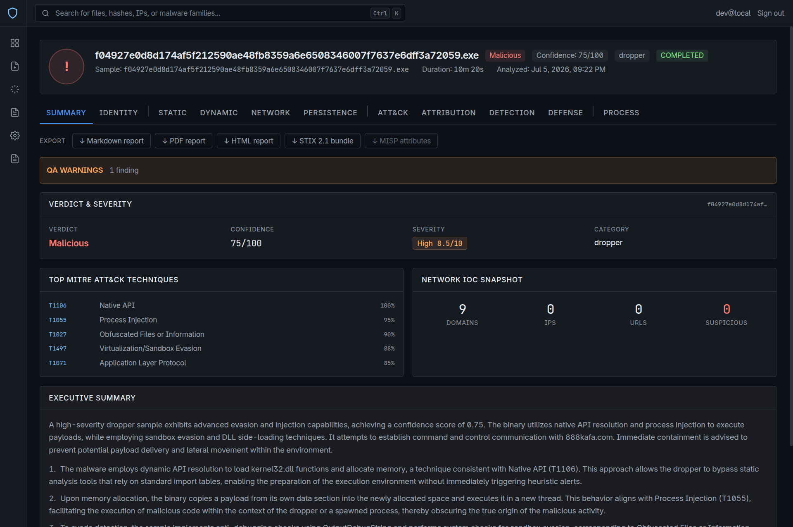
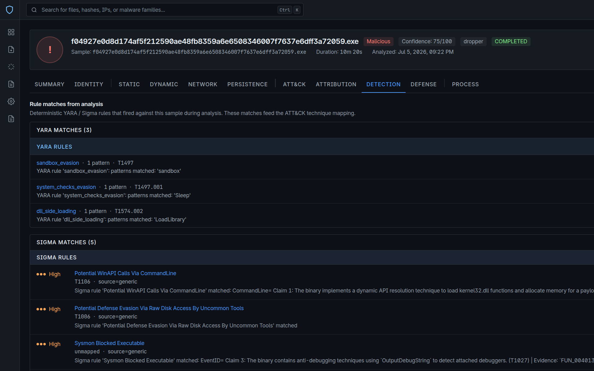

<p align="center">
  
</p>

<h1 align="center">Maljan</h1>
<p align="center"><em>Multi-Agent Malware Analysis Framework</em></p>


[](https://github.com/Root0ne/Maljan/actions/workflows/ci.yml)
[](https://www.python.org/)
[](LICENSE)

Maljan maps evidence about a Windows PE sample to MITRE ATT&CK technique
identifiers and emits a STIX 2.1 bundle. It is mostly not a language model: six
deterministic evidence layers assert techniques from signatures and rules, three
LLM analysts describe behaviour over three channels of evidence, a judge
synthesises a verdict, and a deterministic reconciliation and gating stage
decides what the analyst actually receives. The organising rule is that the
model proposes and code disposes: **the model never emits a technique identifier
or a final set.**

## Web UI

| | |
|---|---|
|  |  |
| **Dashboard.** Totals, failure rate, recent analyses and verdict distribution. | **Analysis detail.** Eleven tabs over one run, with Markdown, PDF, HTML, STIX 2.1 and MISP export. |
|  |  |
| **Detection.** The deterministic YARA and Sigma rules that fired, each with the technique it maps to and the pattern that matched. | **ATT&CK.** Each technique carries where it came from: `SINGLE SOURCE` or `CORROBORATED`, and which layers agreed. |

The last image is the corroboration cascade made visible. A technique asserted by
one layer and a technique three independent layers agree on are different claims,
and the interface says which is which rather than presenting a flat list.

---

## Key Capabilities

| Feature | Description |
|---|---|
| Deterministic grounding | Six Layer-0 sources assert techniques before any model runs: YARA, tool-artifact byte markers, Sigma, PE import capability, LOLBin signed-proxy execution and network DGA entropy. The rule sets behind two of them are covered below. |
| Deterministic technique assignment | The model describes behaviour; a hybrid retrieval index over the official ATT&CK corpus assigns every identifier. This removes identifier recall from a model that does not have the taxonomy memorised. Measured against two external corpora. |
| Multi-agent decomposition | Static, Dynamic and Network analysts each read one evidence channel through one tool server. Sequential by default, because a single local llama-server slot turns fan-out into queue thrash; set `parallel_analysts=True` for hosted APIs where each request gets its own slot. |
| Structured negotiation | A negotiation node tests for consensus and routes disputes to a revision pass, with sycophancy detection and adaptive termination. At matched call budget this contributes +0.0005 F1; the calls it costs are what pay. |
| Multi-layer TTP cascade | Cross-domain weighted scoring (YARA 0.90 down to network 0.20) with corroboration multipliers rising to 1.90 at five independent layers. |
| Reconciliation and gating | After the model: unresolvable identifiers dropped, the cascade's set restored, a confidence cap, and a STIX integrity pass. This stage is why the deterministic layer dominates the output. |
| STIX 2.1 output | Conformance measured with the OASIS `cti-stix-validator` rather than with the integrity pass this project wrote itself, which is how two specification violations were found and fixed. |
| Long-term memory (RAG) | Past analyses and family fingerprints are vectorised in Qdrant and retrieved by similarity. Measured end to end, the three retrieval components contribute nothing; they are kept and reported rather than removed. |
| Comprehensive reports | Every run emits a structured `MalwareReport` rendered as Markdown, JSON, STIX 2.1 and MISP, surfaced through the analysis UI. |
| Post-hoc threat-intel enrichment | An async ARQ worker fills VirusTotal, AbuseIPDB, WHOIS and GeoIP reputation after the verdict ships, so verdict latency is unaffected. |

---

## Architecture

A LangGraph `StateGraph` over one shared state. The analyst stage has two
shapes and the topology is chosen by `parallel_analysts`:

```
START
  │
  ├─ parallel_analysts = False  (the default)
  │     static_analyst -> dynamic_analyst -> network_analyst
  │     one local server slot means fan-out is queue thrash, not speed
  │
  └─ parallel_analysts = True   (hosted APIs, one slot per request)
        START fans out to all three, then fans in
  │
negotiation  <-------- revision
  │  (consensus, or the iteration cap)   ^
  └─ no consensus -----------------------┘
  │
judge
  │   inside this node: the YARA and Sigma scanners, the per-technique
  │   TTP cascade, ATT&CK validation, then the STIX 2.1 bundle
  │
report  ->  END
```

- **ISR (Intermediate Structural Representation).** Agents exchange structured `AgentISR` objects (claims, `evidence_ref`, confidence) rather than raw text.
- **ServiceContainer (DI).** Agents, LLMs, loaders and stores are created and cached in one composition root. No global state.
- **AgentRegistry.** New agents are discovered through the `@register_agent` decorator and the builder wires them dynamically.

---

## Repository layout

```
maljan/
├── apps/
│   ├── api/                 FastAPI app + arq worker; workspace member "maljan-api"
│   └── web/                 Next.js UI; shared analysis panels in src/components/analysis/
├── src/maljan/              the core package: agents, pipeline, providers, analysis, memory
├── services/
│   ├── network-mcp/         PCAP tooling over stdio MCP, bound to the network analyst
│   └── threatintel-mcp/     VirusTotal and AbuseIPDB over stdio MCP, bound to the judge
├── scripts/
│   ├── dev/                 the LLM server launcher, the overnight guard, the Ghidra manager
│   ├── goldens/             one-off capture scripts that write tests/fixtures/golden/
│   ├── knowledge/           builders for the data/ assets and the evaluation fixtures
│   ├── paper/               the paper conformance check and the cohort completer
│   └── settings/            the settings-annotation seeder
├── tests/
│   ├── unit/                mirrors src/maljan, one subdirectory per subpackage
│   ├── api/  integration/  fixtures/
│   └── evaluation/          the measured corpus and its analysis scripts
├── data/                    tracked knowledge assets, loaded lazily, each with a fallback
├── docker/                  Dockerfiles and the compose stack
├── docs/                    README.md (this tree explained), assets/, specs/, plans/
├── Makefile                 every gate and every generator
└── pyproject.toml uv.lock   one uv workspace: maljan plus apps/api
```

One `uv sync --all-extras --all-packages` at the root installs both Python packages. There is no
`PYTHONPATH` anywhere: `maljan` and `app` are installed, in the venv, in the
image and in CI alike.

---

## Quick Start

### Requirements

- Python 3.13+
- [uv](https://astral.sh/uv/)
- Docker + Docker Compose (for full-stack mode)

### Standalone CLI (no Docker)

```bash
# 1. Clone
git clone https://github.com/Root0ne/Maljan.git
cd Maljan

# 2. Install dependencies and fetch the third-party trees
make setup

# 3. Configure environment
# The standalone CLI builds the core `Settings` model bare, which still
# reads the process environment and an optional `.env` in the CWD (this is
# the only place that still works this way — see "Configuration" below).
# Set the active LLM backend and its API key, e.g.:
export LLM__PROVIDER=openai
export LLM__OPENAI__API_KEY=sk-...

# 4. Run a mock analysis (no API key required)
uv run maljan analyze sample_1 --mock --name test.exe

# 5. Run a real analysis
uv run maljan analyze <sha256> --provider openai
```

### Full-Stack Docker (recommended)

The API and the worker read only a small bootstrap contract from the process
environment (database, Redis, MinIO, the two secrets below, a handful of
mount paths); every other application setting — LLM provider, sandbox,
static analyst, tool servers, agents, rate limits — lives in the settings
store and is edited from the web UI (Settings → Configuration) once the
stack is up. A new deployment starts with the catalog defaults and is
configured from there.

```bash
cp docker/.env.example docker/.env
# docker/.env holds the variables compose refuses to start without — there
# is no baked-in default for any of them:
#   GHIDRA_MCP_AUTH_TOKEN     bearer token the ghidra-mcp container requires
#   REDIS_PASSWORD            --requirepass on the redis container
#   QDRANT_API_KEY            QDRANT__SERVICE__API_KEY on the qdrant container
#   POSTGRES_PASSWORD         the database password compose builds DATABASE_URL from
#   MINIO_ROOT_USER            MinIO root account (also MINIO_ACCESS_KEY for the API)
#   MINIO_ROOT_PASSWORD        MinIO root password (also MINIO_SECRET_KEY for the API)
#   SETTINGS_ENCRYPTION_KEY   encrypts secrets in the settings store
#   JWT_SECRET_KEY            signs API session tokens
# Generate the infrastructure secrets, the database and the MinIO password:
python -c "import secrets; [print(f'{k}={secrets.token_urlsafe(32)}') for k in ('GHIDRA_MCP_AUTH_TOKEN','REDIS_PASSWORD','QDRANT_API_KEY','POSTGRES_PASSWORD','MINIO_ROOT_PASSWORD')]"
# pick a MINIO_ROOT_USER of your own, and generate the two application secrets:
python -c "from cryptography.fernet import Fernet; print('SETTINGS_ENCRYPTION_KEY=' + Fernet.generate_key().decode())"
python -c "import secrets; print('JWT_SECRET_KEY=' + secrets.token_hex(32))"
# paste all seven into docker/.env.
#
# Every published port binds to BIND_ADDRESS, which docker/.env.example
# defaults to 127.0.0.1 — the stack is unreachable from the network unless
# you deliberately set BIND_ADDRESS=0.0.0.0 behind a firewall or reverse
# proxy you control.

# The ghidra-mcp image is built from external/, which git does not carry
make external

# If host port 5432 is already taken, publish Postgres elsewhere. This changes
# only the host-side publish: DATABASE_URL is assembled by compose and always
# targets postgres:5432 inside the network.
export POSTGRES_PORT=5433

# Start the stack. The one-shot `migrate` service runs `alembic upgrade head`
# against a healthy Postgres first, and the api and worker services wait for
# it to finish: the API does not migrate on startup, and without the schema
# the one-time configuration import has nowhere to record that it ran.
cd docker
docker compose up -d --build

# A later pull that adds a revision is applied the same way -- the step reruns
# on the next `up` and exits immediately when there is nothing to apply:
docker compose up migrate

# Access points (loopback only, per BIND_ADDRESS above)
# Frontend:      http://localhost:3000
# Backend API:   http://localhost:8000/docs
# Ghidra MCP:    http://localhost:8089/check_connection
# MinIO Console: http://localhost:9001
```

Outside compose, apply the same migrations with `make migrate` from the
repository root. `DATABASE_URL` comes from the process environment only (there
is no `.env` discovery any more), and the target has to be reachable from the
host, so keep it in the gitignored `bootstrap.env` the target sources — the
compose-internal `postgres:5432` will not resolve there.

On a **fresh** deployment, set the Docker-network-only application values from
Settings → Configuration before relying on Ghidra, CAPE or enrichment — compose
no longer computes these for you, so the stack runs degraded (falling back to
`localhost`-shaped catalog defaults) until they are entered once: Ghidra MCP
URL `http://ghidra-mcp:8089`, the CAPE sandbox base URL (your host's, e.g.
`http://host.docker.internal:18000`), and the enrichment Qdrant URL
`http://qdrant:6333` with its `QDRANT_API_KEY` (the same value you generated
into `docker/.env` above). An **existing** deployment upgrading onto this
design enters the same three values the same way, or brings them in with a
JSON export from its previous instance.

> **Local LLM:** Containers reach the host's LLM via `host.docker.internal:8080/v1` (OpenAI-compatible: typically `ik_llama.cpp`'s `llama-server`) — set this from Settings → Configuration. The legacy Ollama path on `:11434` is also wired up as a fallback. `make external` fetches `ik_llama.cpp` at the commit this project was measured against; the model is `Qwen3.6-35B-A3B` quantised to `IQ3_K_R4`, which fits on an 8 GB GPU with a hybrid MoE offload.

### Pre-build the ATT&CK cache (optional)

```bash
uv run python -c "from maljan.memory.attck_validator import ATTCKValidator; ATTCKValidator.get_instance()"
```

---

## `external/` is not in this repository

Two third-party projects are built against and neither is ours to redistribute.
Git ignores the directory; the repository records the ref each was used at, and a
script reconstructs the tree from the upstream repositories:

```bash
make external     # or: make setup, which runs it for you
```

| Project | Ref | Why |
|---|---|---|
| [ghidra-mcp](https://github.com/bethington/ghidra-mcp) | `v5.6.0` | `docker compose` builds the headless disassembly image from this checkout, so the tree has to be on disk before the stack comes up. |
| [ik_llama.cpp](https://github.com/ikawrakow/ik_llama.cpp) | `eb570eb9` | The inference engine. This is the commit the evaluation pins, so fetching it here is what makes that pin reproducible rather than merely recorded. |

### Static and sandbox providers are a choice, not a requirement

The static analyst attaches to one of `ghidra`, `r2`, `capa_yara`, `generic_mcp`
or `none`; the dynamic path pulls its evidence from one of `mock`, `cape2`,
`upload`, `triage` or `rest`. Pick either pair from Settings → Static analysis
provider / Sandbox provider in the web UI, per job at submit time, or set
`core.static.provider` / `core.sandbox.provider` from Settings → Configuration.
Ghidra plus CAPEv2 is the
profile this project's evaluation was measured on and stays the default for
both, but neither is required to run Maljan: `core.static.provider=capa_yara`
with `core.sandbox.provider=upload` needs no external service at all, and
`core.sandbox.provider=mock` needs none either.

What each optional tool costs to turn on:

- **radare2 (`r2`)** — install radare2 itself, then its MCP plugin:
  `r2pm -ci r2mcp`.
- **capa + YARA (`capa_yara`)** — no external service. Pull in the optional
  dependency (`uv sync --extra capa`) and a rule checkout:
  `git clone https://github.com/mandiant/capa-rules data/capa-rules`.
- **Hatching Triage (`triage`)** — a Triage API key; no host of your own.
- **Uploaded report (`upload`)** — nothing to install: an operator attaches
  a report from any supported sandbox when submitting a sample.
- **generic_mcp** — any MCP server you already run. A custom server exposes
  nothing until you tick tools from its probe's manifest in Settings → Tool
  servers, and even so the model can call whatever is ticked, so connect only
  a server you control.

### Connecting your own tool servers

Every MCP server Maljan can attach lives in one place, `mcp.servers`, keyed by
a short name you choose. Two entries are there by default — `network` and
`threatintel`, the two sidecars that ship with the project — and you add your
own from Settings → Tool servers: a name, how to reach the server (a command
for stdio, a URL for HTTP), which analysts it serves, and which of its tools
the model may call.

**A server you add exposes nothing until you say what it may run.** That is
the trust boundary, and it is worth being exact about where it sits. Pressing
"Test" performs one MCP handshake and lists the tools the server advertises;
nothing is called. Ticking a tool adds its name to that entry's allow-list, and
only allow-listed tools are ever handed to the model. An entry with an empty
allow-list is connected and inert. The two built-in sidecars carry no
allow-list at all, which means "every tool they offer" — they are in this
repository, their tool sets are pinned by a test, and narrowing them would
change the profile the evaluation was measured on. Both built-ins can be
disabled from the same screen but not deleted; a run resumes seeing their
full manifest the moment they are re-enabled.

What a tool server's process can see is equally explicit. It is started with an
argument list, never through a shell. Its environment is a fixed base set
(`PATH`, `HOME`, locale, `TMPDIR`, `JAVA_HOME`, and a handful more) plus
exactly the variable names you list under "Environment names passed through" —
so `services/threatintel-mcp` sees `VIRUSTOTAL_API_KEY` and `ABUSEIPDB_API_KEY` and
nothing else, and no server sees the database URL, the settings encryption key
or any LLM credential. Listing a name under `env_allow` is the only way a
credential from the process's own environment reaches a tool server; a value
you type into the server's own `env` field is an ordinary, UI-readable
setting, not a secret. A working directory, if you set one, has to resolve
inside the repository or to an absolute directory that already exists — it is
never created for you. A bearer token for an HTTP server is typed once and
stored the way every other secret in Maljan is stored: encrypted with
`SETTINGS_ENCRYPTION_KEY`, in a row of its own (`core.mcp.servers.<key>.auth_token`)
rather than in the server list's JSON, never returned by the API and never
written into a run summary. Without that key set, the process refuses to
start at all (`SETTINGS_ENCRYPTION_KEY` is part of the bootstrap contract),
so there is no read-only fallback mode to fall back to — a token is always
typed into the UI. A server
bound to the static or dynamic analyst degrades rather than failing a job: if
it cannot be reached, the run says so in its degradation reasons and
continues on the evidence it has.

### Agents and profiles

The three analysts and the judge are configuration, not code. Settings →
Agents holds two maps:

**Agent definitions** — every agent Maljan can run, keyed by a short name.
Each carries a role (`static`, `dynamic`, `network`, `judge` or `generic`), a
prompt, the tool servers it receives and, for the static-flavoured roles, the
static provider it reads. The three built-in analysts (`static`, `dynamic`,
`network`) can be disabled through their enabled switch and are otherwise
read-only; the judge is read-only in full, always runs and cannot be cloned.
To change an analyst, clone it. A clone keeps its source's class and its ISR
extraction, so a `static` clone pointed at radare2 is a real static analyst reading r2 — the
prompt is reassembled with radare2's fragment in the middle and nothing else
moves. A `generic` definition runs a plain ReAct
analyst with the prompt you write and the tools you tick; a probe of it
returns the resolved prompt along with the tool names and the model id, so you
can read exactly what the model will see before a job spends a token on it.

**Profiles** — named, ordered sets of analysts. The order is the order they
run in on a single-slot local model. `default` is the three-analyst
architecture this project was measured on and is read-only; clone it to build
your own. A job may name a profile at submit time; without one it uses the
profile in the settings. A profile naming a disabled analyst is refused at
submit, not partway through the run.

Two things to know before you build one. An agent's model is set through
`core.llm.agents`, a map keyed by agent name with a provider and a model per
entry — not on the definition — so the definition and the model it runs on
cannot drift out of sync with each other. And a definition can only narrow
what a tool server exposes: a tool outside that server's allow-list is
refused when you save, so adding an agent never widens the trust boundary the
server section above describes. A `ToolRef` of kind `provider` — "give this
agent its static provider's own tools" — is only valid on a `generic`
definition; a built-in role already opens its provider itself.

The **Resolve** button on a definition card shows exactly what that agent
would get — the assembled prompt's size and hash, the resolved tool names, the
model id and the static provider — without running a job or spending a token.

### A sandbox Maljan has never heard of

`core.sandbox.provider=rest` (Settings → Configuration → Sandbox) drives an HTTP sandbox you describe rather than one
this project has an adapter for. You give it a base URL, the path a sample is
POSTed to, where the task id is in the reply, where to poll and which state
values are terminal, and where the finished report is. If that report is
CAPE-, Cuckoo- or Triage-shaped, say so and it goes through the same reader the
matching adapter uses; a dedicated Triage sandbox provider still exists
separately for the Triage cloud service itself; the REST provider's own
`triage` report format only maps a single report body shaped like one, and
does not replace it as the path for Triage. If the report is in its own
shape, describe where each channel lives with an
[RFC 9535](https://www.rfc-editor.org/rfc/rfc9535.html) JSONPath. Paste one
real response into the settings editor and press "Preview mapping" to see, in
one pass over that response, per channel how many rows each path selected and
how many survived — before a sample is ever detonated. A channel you leave
empty is reported as unavailable in the finished report, so a sandbox that
publishes no DNS log never reads as a sample that made no DNS requests. A
`verify_tls=false` setting is flagged as a warning, not refused, since some
operator-run sandboxes sit behind a self-signed certificate on a network you
already trust.

**Known limits.** Every job still uses whichever server `mcp.servers` says
serves its analyst — there is no per-job server selection yet. And
`resolve_mcp_args` roots a *relative* argument containing a `/` under the
repository — a flag (anything starting with `-`) and an already-absolute path
are both left untouched — so the residual is a non-path value that happens to
contain a slash and is passed positionally (e.g. `https://x/y`), which is
rewritten when it should not be; both are open follow-ups for a later
sub-project.

CAPE itself is somebody else's platform and nothing here installs, builds or
packages it. It wants a Linux host of its own with KVM and its own Windows
guest images registered as analysis machines, which is a deployment rather
than a dependency. What this project does is talk to one over its REST API.
Point it at yours from Settings → Configuration → Sandbox:

- `core.sandbox.cape2.base_url` — `http://<your-cape-host>:8000`
- `core.sandbox.cape2.api_token` — the token from that instance (stored
  Fernet-encrypted, never read back)

With no sandbox reachable the pipeline degrades rather than fails: the dynamic
path is skipped and the run completes on static evidence, a behaviour pinned by a
test.

---

## Whose rules these are

Two rule sets drive the deterministic layer and only one of them is ours.

**Sigma is SigmaHQ's.** The corpus is not in this repository and never should
have been: it was committed here as 2,651 files by Florian Roth, Nasreddine
Bencherchali, frack113 and the rest of [SigmaHQ](https://github.com/SigmaHQ/sigma),
carrying neither their licence nor their names. Their rules are published under
the Detection Rule License. `make external` clones the corpus at a pinned release
into `data/sigma_rules`, licence file included, and git ignores the directory. No
rule in it was written here.

**The YARA-TTP set is ours.** `data/yara_ttp_rules.yaml` holds 30 hand-written
patterns that map byte and API-name markers straight to ATT&CK identifiers. It is
a small grounding set for this pipeline rather than a detection corpus, and it is
not a substitute for one.

The Sigma layer degrades to zero rules when the corpus is absent: it logs the
missing directory and the run continues on the other five Layer-0 sources.

There is a third thing that is easy to confuse with these. `MalwareReport` can
pivot the indicators one run produced into **draft** YARA, Sigma and Suricata
rules, offered through `/api/v1/reports/{report_id}/signatures/{kind}`. Those are
generated from that sample's own evidence for an analyst to review. This project
does not author detection rules.

---

## API Endpoints

REST lives under `/api/v1`. The health probes and the WebSocket sit on the
application root, not under that prefix.

| Method | Path | Description |
|--------|------|-------------|
| POST | `/api/v1/auth/register` | User registration |
| POST | `/api/v1/auth/login` | JWT token login |
| POST | `/api/v1/auth/refresh` | Exchange a refresh token |
| GET, PATCH | `/api/v1/auth/me` | Read or update the current user |
| POST | `/api/v1/samples/upload` | Upload a sample |
| GET | `/api/v1/samples` | List samples |
| POST | `/api/v1/jobs` | Create an analysis job |
| GET | `/api/v1/jobs/{job_id}` | Job status |
| GET | `/api/v1/jobs/{job_id}/events` | Server-sent event stream for one job |
| GET | `/api/v1/reports/{report_id}` | Report summary |
| GET | `/api/v1/reports/{report_id}/full` | The whole `MalwareReport` |
| GET | `/api/v1/reports/{report_id}/markdown` | Markdown render |
| GET | `/api/v1/reports/{report_id}/pdf` | Print-ready PDF |
| GET | `/api/v1/reports/{report_id}/html` | Self-contained HTML |
| GET | `/api/v1/reports/{report_id}/stix` | STIX 2.1 bundle |
| GET | `/api/v1/reports/{report_id}/mitre` | ATT&CK technique set |
| GET | `/api/v1/reports/{report_id}/iocs` | Extracted indicators |
| GET | `/api/v1/reports/{report_id}/signatures/{kind}` | Generated YARA, Sigma or Suricata |
| POST | `/api/v1/reports/{report_id}/enrich` | Queue post-hoc threat-intel enrichment |
| GET | `/api/v1/dashboard/stats` | Dashboard metrics |
| GET | `/api/v1/system/status` | Component health |
| GET | `/api/v1/audit/logs` | Audit trail |
| WS | `/ws/analysis/{job_id}` | Real-time analysis events |
| GET | `/health`, `/healthz` | Liveness probes |
| GET | `/docs` | Swagger UI (served only when `DEBUG=true`) |

---

## Security

**Sessions.** Login and refresh return the access token in the response
body only; the API never puts it in a cookie. The refresh token instead
rides an HttpOnly, `SameSite=Lax` cookie named `maljan_refresh`, scoped to
the path `/api/v1/auth`, so it is invisible to page JavaScript and is only
ever sent back to the auth endpoints. `Secure` is on by default outside
`DEBUG=true` (`COOKIE_SECURE` overrides either way). `POST /auth/logout`
clears that cookie and consumes the refresh token server-side; the web
client keeps only the short-lived access token, in memory and
`localStorage`, and refreshes it silently before it expires.

**WebSocket auth.** `/ws/analysis/{job_id}` takes the JWT access token as a
WebSocket subprotocol — `maljan.v1.<jwt>` — never as a query string, so it
does not land in access logs or browser history. The server accepts and
echoes back only the bare `maljan.v1` subprotocol. A connection lacking that
token subprotocol is rejected with close code 4401; every other auth
failure (invalid token, unknown job, a job that belongs to someone else)
closes with the generic policy code 1008. The frontend's WebSocket client
treats both codes as terminal and does not attempt to reconnect on them.

**API docs.** `/docs`, `/redoc` and `/openapi.json` are served only when
`DEBUG=true`; in a production deployment those paths do not exist.

**Report HTML.** `GET /reports/{report_id}/html` is self-contained (inline
CSS, inline SVG, no external requests) and is served with a
`Content-Security-Policy` that allows inline `<style>` only via a
per-response nonce (`style-src 'nonce-<random>'`); everything else
(`script-src`, `default-src`) is denied.

**Throttle degradation.** The per-account login/refresh throttle is backed
by Redis. When Redis is unreachable, refresh-token consumption fails
closed — no refresh succeeds until Redis is back — while the login lock
fails open rather than locking every account for the outage. This state is
visible without authentication in `GET /health?deep=true` as
`throttle_degraded`, and to an authenticated admin in `GET /system/status`
as `throttle.available` / `throttle.degraded_since` / `throttle.last_error`
and `audit_write_failures`.

**Sample copies on disk.** The worker's private working copies of a sample
live under `data/uploads/.tmp` (download staging) and `<SAMPLES_DIR>/.work`
(the Ghidra bind-mount mirror), both created `0o700` with files `0o600`.
Every worker startup sweeps both directories for copies left behind by a
process that was killed mid-job.

**Uploaded sandbox reports outlive the submit dialog.** A report attached
under the `upload` sandbox provider is kept until the sample itself is
deleted, listed under that sample regardless of whether the analysis it was
attached for ever ran. Attach a report in the submit dialog and abandon the
submission, and the report stays listed under the sample anyway; nothing
today cleans that up automatically (follow-up in sub-project B).

**Trusted proxies.** `TRUSTED_PROXY_IPS` takes CIDR networks (e.g.
`10.0.0.0/8`), not just bare IPs — only requests arriving through one of
these networks may set `X-Forwarded-For` for rate-limit identity. Left
empty, only the direct TCP peer address is trusted.

**MCP sidecar environment.** Each MCP sidecar subprocess (Ghidra, CAPE,
network capture, judge) starts from a fixed, minimal base environment
(`PATH`, `HOME`, locale/timezone vars, `JAVA_HOME`, no LLM keys, no database
URL, no encryption key) plus only the credentials that server is documented
to read — the judge sidecar is the one that additionally sees
`VIRUSTOTAL_API_KEY` and `ABUSEIPDB_API_KEY`.

**Enrichment domain filter.** Threat-intel enrichment skips IP literals,
single-label names and special-use/private DNS suffixes before ever calling
a public reputation service, so internal hostnames are not leaked to
VirusTotal or spent against its quota for an answer that is always
"unknown".

**Static analysis.** `make semgrep` runs the same `p/python` and
`p/security-audit` rulesets, pinned to the same semgrep version, as the
CI "Semgrep" job, across `src/`, `apps/api/`, `services/` and
`scripts/`.

**Compose secrets and network binding** are documented in the Full-Stack
Docker section above (`GHIDRA_MCP_AUTH_TOKEN`, `REDIS_PASSWORD`,
`QDRANT_API_KEY`, `BIND_ADDRESS`).

---

## Static-analysis data assets

Deterministic detection is data-driven. These live under `data/`, are loaded
lazily, are cached per path, and **every one of them degrades to a built-in
fallback when absent**: a missing file costs depth, never a run.

| Asset | What it drives |
|---|---|
| `api_behaviour_map_v1.json` | Windows API → behaviour category, ~780 names / 13 categories. Each category carries a `tier`; only `high`/`medium` mark an import *suspicious*, so categorising `RegOpenKeyExA` does not mean accusing it. |
| `api_attck_map_v1.json` | Windows API → ATT&CK, 47 techniques. This is what gives a **sandbox-less run real technique coverage**: with CAPE unreachable the Sigma corpus is telemetry-gated and contributes nothing. |
| `tool_artifacts_v1.json` | Offensive-tool / RAT byte markers. The only source of a **malware family name without a sandbox**. |
| `packer_signatures_v1.json` | Packer / protector identification, ranked: section name > entry point > string. |
| `language_signatures_v1.json` | Source-language and runtime fingerprints, scored rather than substring-matched. |

The first two are generated: the curated lists live in the builder, not the
JSON, so a reader can see *why* an API is classified the way it is:

```bash
make prepare-api-db   # validates every ATT&CK ID before writing
```

**Restart the worker after regenerating.** `data/` is bind-mounted, so the
container sees the new file immediately, but each asset is cached per path in
the loading process, and the arq worker is long-lived. It keeps serving the
catalog it read on first use, and the run looks successful while classifying
against stale data. Editing a data asset without

```bash
docker compose restart worker
```

is indistinguishable, in the report, from not having edited it at all.

## Development

```bash
# Run all tests
make test

# Lint + type check
make lint
make typecheck

# Full quality gate
make check

# The gate covers every Python directory in the repo: src/, tests/, apps/api/,
# services/ and scripts/. It used to be src/ and tests/ only, which
# meant the FastAPI app and the arq worker were never type-checked anywhere,
# and a sidecar could sit unformatted for weeks because pre-commit only ever
# sees staged files.

# If `git commit` prints "`pre-commit` not found. Did you forget to activate
# your virtualenv?", the installed hook has a stale absolute interpreter path
# baked into it (it happens whenever the venv is recreated, or when the
# snap-installed toolchain the venv points at is upgraded). Reinstall it: # do NOT reach for --no-verify:
uv run pre-commit install

# Benchmarks
make benchmark-attck
make benchmark-tram
```

Tests live under `tests/unit/` (mirroring `src/maljan`), `tests/api/`,
`tests/integration/`, `tests/fixtures/` and `tests/evaluation/`. Generators and
operator tools live under `scripts/{dev,goldens,knowledge,paper,settings}/`;
`make -n <target>` shows which one a target runs.

### Making a code change actually take effect

**Read this before debugging anything that "should have worked".** On the
production stack neither the frontend nor the worker picks up a source edit,
and neither of them tells you:

| Service | Source | Picks up an edit? |
|---|---|---|
| `backend-api` | bind-mounted | **yes**: uvicorn `--reload` |
| `backend-worker` | bind-mounted | **no**: `arq` never re-imports a changed module |
| `frontend` | **baked into the image** | **no**: it serves a Next.js standalone build |

So on the production stack:

```bash
make worker-restart   # after ANY Python edit under src/ or apps/api
make fe-rebuild       # after ANY frontend edit; a plain restart is not enough
```

Both traps cost a full debugging session on 2026-07-26: a live analysis ran the
*previous* worker build and silently wrote nothing, and the deployed UI served a
pre-change bundle while every local check passed.

The alternative is the development overlay, where both are live:

```bash
make dev-up      # next dev + watchfiles-supervised arq, source mounted
make dev-logs
make dev-down
```

### Memory

An analysis can take the worker process from ~3.4 GB to ~8.5 GB. On a host that
also runs a local LLM this is the difference between a working machine and a
frozen one, so the worker is capped (`mem_limit: 8g`) and restarts itself
between jobs above `WORKER_RSS_RESTART_MB`. Set `MALJAN_MEMPROBE=objects` (or
`tracemalloc`) to see where the growth happens: `src/maljan/core/memprobe.py`
explains what the numbers mean.

---

## Configuration

The API and the worker read a small, validated **bootstrap contract** from
the process environment — the values a process needs before it can reach
the settings store at all — and nothing else. Everything else an operator
configures (LLM provider and credentials, sandbox and static analyst,
tool servers, agents, rate limits, enrichment, ...) is an **application
setting**, edited from the web UI, not the environment.

**Bootstrap contract.** See `bootstrap.env.example` at the repository root
for the full, commented list; the short version:

```bash
DATABASE_URL=postgresql+asyncpg://maljan:<postgres-password>@localhost:5432/maljan
REDIS_URL=redis://localhost:6379/0
MINIO_ENDPOINT=localhost:9000
MINIO_ACCESS_KEY=minioadmin
MINIO_SECRET_KEY=<strong value; boot refuses "minioadmin" outside debug>
SETTINGS_ENCRYPTION_KEY=<generate: python -c "from cryptography.fernet import Fernet; print(Fernet.generate_key().decode())">
JWT_SECRET_KEY=<generate with openssl rand -hex 32>
```

A missing required variable, an empty or placeholder JWT secret outside
debug, or an invalid `SETTINGS_ENCRYPTION_KEY` aborts the process at
startup with one message naming every problem
(`apps/api/app/bootstrap.py`). `/health` reports `config: {bootstrap,
encryption}` once the process is up. For Docker, these
variables are supplied by `docker/docker-compose.yml` (built from
`docker/.env`'s infrastructure secrets) and never read from a `.env` file
directly; for a bare `uvicorn`/`arq` process, export them into the shell
(`set -a; . ./bootstrap.env; set +a`, or `make dev-up` / `make migrate`,
which do this for you when `bootstrap.env` exists). The same contract is
the whole interface for any other orchestrator: a Kubernetes `Secret` /
`ConfigMap` projected as container env, or a systemd unit's
`EnvironmentFile=`, both work the same way compose does here — inject the
bootstrap variables, nothing more; the process never persists or discovers
its own deployment secrets.

**Application settings, from the UI.** Administrators (Settings →
Configuration; the tab is shown but disabled for everyone else) change
every core pipeline setting and the API's runtime-safe knobs here — there
is no environment-variable path for these any more. Each field shows
whether its current value is the catalog default or a stored override.
A saved change either takes effect immediately (`live`, read through a
5-second cache), at the start of the next analysis (`next job`, the worker
reads overrides when a job starts), or requires a process restart
(`restart` — shown read-only: the bootstrap contract above). Secret fields
(API keys, tokens) are stored Fernet-encrypted under
`SETTINGS_ENCRYPTION_KEY` and are only ever set or cleared from the UI — a
saved secret is never read back, the API returns whether it is set and a
short hint. "Test connection" checks the LLM endpoint (OpenAI, Anthropic,
Ollama or Gemini, whichever is selected), Ghidra MCP, the CAPEv2 sandbox,
Qdrant, Redis, VirusTotal and AbuseIPDB against the values you are about to
save, before you save them. The `capa_yara` probe is neither of those
services: it counts rule files locally. The indicator reports ok when capa
itself imports and its rules directory holds rules; the YARA half is checked
too, but only ever named in the detail text — a missing or empty YARA rules
directory does not flip the indicator, since capa evidence alone is enough
for the provider to run. "Test MCP server" launches one configured tool
server and lists what it offers; "Test sandbox API" asks a REST sandbox's
status endpoint about a task that does not exist, so any answer other than a
refused credential means the endpoint and the token are right.

**Export and import.** "Export configuration" downloads every stored
override as JSON (`maljan-settings.json`; secret values are omitted and
listed by key under `secrets_omitted`). "Import configuration" (admin
only) accepts the same document, validates every key against the catalog,
previews what will change, and applies it through the same path a UI edit
takes — audited, encrypted where secret. This is how a configuration moves
between environments; there is no `.env` export or import any more. Every
analysis still records the settings that were actually in effect, and
which of them came from a stored override, in its run summary.

**Upgrading from a `.env` deployment.** There is no automatic import. Enter
the settings in Settings → Configuration, or import a JSON export. The
standalone CLI is the one remaining consumer that still reads `.env` and the
environment directly — see the Quick Start section above.

---

## Design Principles

- **No hallucinated TTPs:** Every ATT&CK technique ID is validated against the authoritative dataset before STIX generation.
- **No sycophancy:** Agents cannot passively agree. Cosine-similarity monitoring triggers forced re-evaluation when convergence is cosmetic.
- **Graceful degradation:** YARA, Sigma, ATT&CK validation, memory retrieval, and sandbox integration are all optional. The pipeline always produces a verdict, even offline.
- **Protocol-based extensibility:** `MemoryStore`, `SandboxClient`, and `DataLoaderProtocol` are runtime-checkable Protocols. Swap backends without touching pipeline code.
