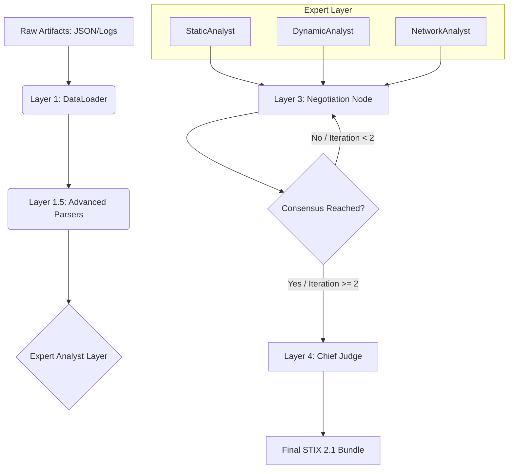

# Maljan: Advanced Multi-Agent Malware Analysis Pipeline

Maljan is an enterprise-grade cyber security analysis framework designed for automated, modular, and collaborative malware evaluation. Unlike monolithic LLM approaches, Maljan utilizes **LangGraph** to orchestrate a specialized "Expert Agent" network that mimics a team of human analysts.

---

## 🏗 Architecture & Flow (Deep-Dive)

Maljan operates on a cyclic, consensus-driven state graph. Below is the high-level data flow from ingestion to structured intelligence (STIX 2.1).



### 📥 Layer 1: Data Ingestion & Enrichment
Binary artifacts and tool outputs are managed by the `DataLoader` (`src/maljan/integrations/data_loaders.py`). This component handles file I/O and provides a unified interface for different analysis sources.

### 🧹 Layer 1.5: Intelligent Parsing Engine
To prevent LLM context window issues and "noise" interference, Maljan implements a specialized Parsing/Refinement layer:
- **Noise Filtering**: Uses keyword-based blacklists to remove standard system DLL loads (e.g., `kernel32.dll`, `advapi32.dll` loads that aren't part of a suspicious chain).
- **Behavioral Aggregation**: Groups repetitive sequences. If a malware samples a registry key 1000 times, the `DynamicParser` collapses this into a single metric count to save tokens.
- **Signature Matching**: Identifies known-malicious API sequences (e.g., `VirtualAllocEx` -> `WriteProcessMemory` -> `CreateRemoteThread`) and labels them as **🔴 HIGH** severity flags in the Markdown summary.

### 🧠 Layer 2: Expert Modular Analysts (`src/maljan/agents/`)
Specialized agent classes inheriting from `BaseAnalyst`. Each possess independent system prompts and MITRE ATT&CK focus:
- **StaticAnalyst**: Evaluates T1027 (Obfuscation), T1106 (Native API), and hardcoded IOCs.
- **DynamicAnalyst**: Detects T1055 (Process Injection), T1547 (Persistence), and behavioral anomalies.
- **NetworkAnalyst**: Maps T1071 (C2 protocols), beaconing patterns, and DGA queries.

### ⚖️ Layer 3: Müzakere (Negotiation) Engine
Powered by **LangGraph** State management. 
- **Mediator**: The `JudgeAgent` compares analyst reports to find contradictions (e.g., Static analyst says "no networking" but Network analyst finds active beacons).
- **Early Exit logic**: Implements an `is_consensus` flag in the graph state to stop iterations early if experts reach 100% agreement, saving time and tokens.

### 📝 Layer 4: Judge & STIX 2.1 Verdict
Final decisions are serialized using **Pydantic Structured Output** binding to ensure 100% compliance with the **STIX 2.1** specification. Output includes `Malware`, `Indicator`, `Relationship`, and `AttackPattern` (MITRE Map) objects.

---

## ⚙️ Technical Core & State Management

### MalwareState (`src/maljan/schemas/agent_states.py`)
The "Heartbeat" of the system. Uses `TypedDict` with a **State Reducer**:
```python
discussion_history: Annotated[list[AgentArgument], operator.add]
```
- **State Reducer Logic**: The `Annotated` type with `operator.add` tells LangGraph that this specific field should not be overwritten. Instead, every time a node returns a list of `AgentArgument`, it is **appended** to the previous state. This enables persistent memory across the negotiation loop.
- **IsConsensus Control**: A boolean flag that allows the `should_continue_negotiation` router to exit the loop before the `iteration_limit` (default: 2) is reached.

### 🤖 LLM Integration & Structured Output
Maljan uses the **LangChain** ecosystem for model interactions:
- **Binding**: The `JudgeAgent` uses `.with_structured_output(Bundle)` to force the LLM to emit a valid Pydantic model instead of raw text.
- **Fallback Logic**: If the API key is missing, the system enters **Mock Mode** (`nodes.py:_is_mock_mode`), returning deterministic sample reports to allow for pipeline testing without API costs.

### Hata Yönetimi (Error Handling)
Granular exception hierarchy defined in `src/maljan/core/exceptions.py`:
- `MaljanError`: Root exception.
- `AnalystError`: Logic failures within an agent.
- `DataLoadError`: I/O or JSON corruption issues.

### Centralized Logging
Powered by `src/maljan/core/logger.py`. Captures not just errors, but the "Reasoning" of each agent, making the system transparent (Explainable AI).

---

## 🛠 Developer & Quality Standards

Maljan is built for production scalability:
- **Package Management**: [uv](https://astral.sh/uv/) (Astral) for deterministic environment locking.
- **CI/CD Quality Gates**:
  - `ruff`: For lightning-fast linting and formatting.
  - `mypy`: Strict static type checking to prevent runtime TypeErrors.
  - `pytest`: Full graph-state behavior testing.
- **Unified Entrypoint**: `Makefile` with `make check` and `make format`.

---

## 📂 Project Structure Map

```text
Maljan/
├── data/samples/           # Tool artifacts (Ghidra, CAPEv2, Zeek)
├── src/maljan/
│   ├── agents/             # Expert Logic (Modular & OOP)
│   ├── core/               # System Heart (Config, Logger, Exceptions)
│   ├── graph/              # Orchestration (Nodes & Workflows)
│   ├── integrations/       # External Systems (LLM, Data Loading)
│   ├── parsers/            # Refinement Layer (Layer 1.5)
│   └── schemas/            # Data Contracts (STIX, Graph State)
├── tests/                  # Integration & Unit Testing
├── .env.example            # Configuration boilerplate
└── Makefile                # Quality gate entrypoint
```

---

## 🚀 Installation & Verification

1. **Install uv**: `curl -LsSf https://astral.sh/uv/install.sh | sh`
2. **Sync Env**: `uv sync`
3. **Run Suite**: `make check`

**Maljan** is designed to solve complex malware attribution problems where single-model analysis fails due to data volume or multi-vector obfuscation.
