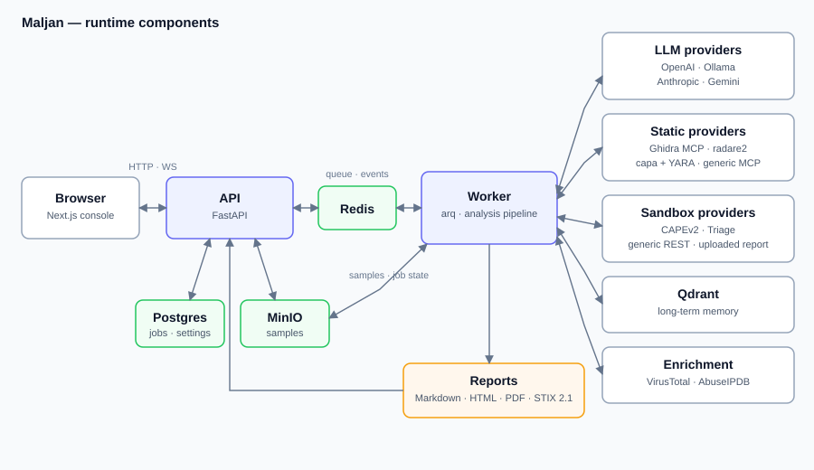

<div class="mj-hero" markdown>


# Maljan

<p class="mj-tagline">Multi-agent malware analysis in which every claim in the
report resolves back to the tool call it came from.</p>

Maljan connects LLM agent teams to malware-analysis tools: signature scanners,
rule engines, binary and capture readers, a sandbox, an ATT&CK catalogue. The
output is a report against MITRE ATT&CK and a STIX 2.1 bundle.

[Quick start](getting-started.md){ .md-button .md-button--primary }
[View on GitHub](https://github.com/Root0ne/Maljan){ .md-button }

</div>

<div class="grid cards" markdown>

-   :material-rocket-launch-outline:{ .lg .middle } __Quick start__

    ---

    From a clean checkout to a first finished analysis on the compose stack:
    the two configuration files, the first account, the first run.

    [:octicons-arrow-right-24: Quick start](getting-started.md)

-   :material-monitor-dashboard:{ .lg .middle } __Console__

    ---

    The web console: submitting samples, following a run as a conversation,
    reading the evidence ledger and the report.

    [:octicons-arrow-right-24: Console](console.md)

-   :material-brain:{ .lg .middle } __LLM providers__

    ---

    OpenAI-compatible endpoints (DeepSeek included), Anthropic, Gemini,
    Ollama and a local llama.cpp server, per agent if you like.

    [:octicons-arrow-right-24: LLM providers](providers/index.md)

-   :material-tools:{ .lg .middle } __Tools__

    ---

    Ghidra, radare2, capa and YARA, CAPE and Triage sandboxes, VirusTotal,
    the built-in analysis sidecars and any MCP server of your own.

    [:octicons-arrow-right-24: Tools](tools/index.md)

</div>

## Key capabilities

- :material-file-tree-outline: **Teams are configuration, not code.** A team is
  an ordered list of stages — triage, the passes the sample is worth, a debate,
  a verdict and a report — each with a condition, so a team applies to a sample
  rather than being written for one. See [Teams and profiles](usage/teams.md).
- :material-format-list-numbered: **An evidence ledger with citable ids.** Every
  tool call is written to the ledger as `ev_NNNN`, and every section of the
  report names the ids it was built from. See [the evidence
  ledger](architecture.md#the-evidence-ledger).
- :material-scale-balance: **The agent decides, the code says what is wrong.**
  Nothing rewrites a claim, a technique id, a confidence or an attribution
  behind the producer's back: a problem goes back to the producer as feedback,
  with one turn to fix it. See [validation loops](architecture.md#validation-loops).
- :material-file-search-outline: **Format-agnostic routing.** The sample's own
  bytes decide its route (PE, ELF, Mach-O, APK, DEX, documents, scripts,
  archives); a format nothing recognises gets the neutral path and a report
  that says so. See [format routing](architecture.md#format-routing).
- :material-export-variant: **Reports that other systems can act on.** Markdown,
  HTML, PDF, the full JSON document, STIX 2.1, an IOC feed with a publish
  decision on every row, and detection drafts. See [Reports and
  exports](usage/reports-and-exports.md).
- :material-cog-outline: **Configured from the console.** A small bootstrap
  environment, and every other setting in a store edited from the web console,
  with setup guides and connection tests. See
  [Configuration](configuration.md).

## Multi-agent architecture in brief

A run is one team executing over one sample. The deterministic triage pack
establishes the facts first — what the file is, its hashes and signature, what
the rule engines and the reputation services say — and writes each to the
evidence ledger. The analysts of each stage then call the tools they were
given, the debate puts their positions against each other, the judge states the
verdict, and the report is assembled from the ledger and the claims that cite
it.



The components, the job lifecycle and every stage are described in
[Architecture](architecture.md).

## A quick example

Upload a sample and start an analysis with the `default` team.

=== "Console"

    <div class="mj-steps" markdown>

    1. Open the console at `http://localhost:3000` and sign in.
    2. Upload the sample and start an analysis.
    3. Watch the **CONVERSATION** tab: every agent's messages, its tool calls
       and the verdict, with each stage filling in on the analysis header.
    4. Read the report from the evidence up: every section carries the ledger
       ids it was built from, and each opens that call on the **EVIDENCE** tab.

    </div>

=== "REST API"

    ```bash
    TOKEN=$(curl -s -X POST http://localhost:8000/api/v1/auth/login \
      -H 'Content-Type: application/json' \
      -d '{"email":"you@example.com","password":"..."}' | python -c 'import json,sys; print(json.load(sys.stdin)["access_token"])')

    curl -X POST http://localhost:8000/api/v1/samples/upload \
      -H "Authorization: Bearer $TOKEN" -F 'file=@sample.exe'

    curl -X POST http://localhost:8000/api/v1/jobs \
      -H "Authorization: Bearer $TOKEN" -H 'Content-Type: application/json' \
      -d '{"sample_id":"<id from the upload>"}'
    ```

=== "CLI, without Docker"

    ```bash
    uv run maljan analyze sample_1 --mock --name test.exe
    ```

    The standalone CLI runs the pipeline without the API, the worker or any of
    the backing services, and reads the process environment rather than the
    settings store.

!!! warning "Analyse malware only in isolated, authorised environments"

    Maljan handles live malware. Run it, and any sandbox it submits to, only on
    hosts and networks you are authorised to use for that purpose, isolated
    from production systems and data. A sandbox detonates the sample; the mock
    sandbox, the default, executes nothing. Uploading a sample to an external
    service such as VirusTotal publishes it; that tool ships unticked. See
    [Security](security.md#handling-samples).

## All documents

Each document is written against the code in this repository: the bootstrap
contract in `apps/api/app/bootstrap.py`, the settings catalog in
`src/maljan/core/`, the routers under `apps/api/app/api/v1/` and the compose
stack in `docker/`.

| Document | What it covers |
| :-- | :-- |
| [Quick start](getting-started.md) | Prerequisites, the two configuration files, starting the stack, first login and first analysis. |
| [Console](console.md) | The navigation tree, the analysis tabs, the Conversation view and how the console follows a run. |
| [Running an analysis](usage/running-an-analysis.md) | Samples, jobs, the per-job overrides, the sandbox choice and following a run. |
| [Teams and profiles](usage/teams.md) | The teams that ship, stages and conditions, the measurement baseline, writing a team of your own. |
| [Reports and exports](usage/reports-and-exports.md) | The report, its renderings, STIX, the IOC feed, detection drafts and comparing two runs. |
| [LLM providers](providers/index.md) | The four provider backends, per-agent models and fallbacks, and a page per provider. |
| [Tools](tools/index.md) | Static providers, sandboxes, VirusTotal, the built-in sidecars and generic MCP servers. |
| [REST API](api.md) | Router groups, the evidence endpoint, the run-summary fields, the stage events on the WebSocket, authentication and pagination. |
| [MCP servers](integrations/mcp-servers.md) | Transports, remote sample delivery, and the conventions that make a tool server a good citizen of a run. |
| [CI](integrations/ci.md) | Driving Maljan from a pipeline with an API key. |
| [Configuration](configuration.md) | The bootstrap environment contract, Settings → Configuration, the setup guides, connection probes, JSON export and import, secret storage. |
| [Architecture](architecture.md) | Components, the request and job lifecycle, teams as stages, agents and their tools, the evidence ledger, validation loops and report assembly. |
| [Security](security.md) | Authentication, roles, API keys, secret encryption, what an export leaves out, CORS and cookie flags, vulnerability reporting. |
| [Deployment](deployment.md) | Compose services and healthchecks, required secrets, health endpoints, Kubernetes and systemd notes, upgrades and migrations. |
| [Operations](operations.md) | Logs, what a run's metrics mean, staged samples, the audit trail, rate limits, backups and a troubleshooting table. |
| [Development](development.md) | Repository layout, `make` targets, the test suites, CI jobs and the branch workflow. |
| [Benchmark](benchmark/index.md) | The benchmark: samples, models, the scoring key, results across iterations and against a human report, the findings beyond it, the false-positive control and limitations. |
| [Paper](paper.md) | Where the published evaluation, its harness and its fixtures live. |

Images used by these documents and by the top-level
[README.md](https://github.com/Root0ne/Maljan/blob/dev/README.md) live in
[assets/](https://github.com/Root0ne/Maljan/tree/dev/docs/assets).

## Historical design record

The specs, plans and superpowers notes that once lived under `docs/specs/`,
`docs/plans/` and `docs/superpowers/` are no longer carried in the working
tree; read them with `git log -- docs/plans docs/specs docs/superpowers`.
