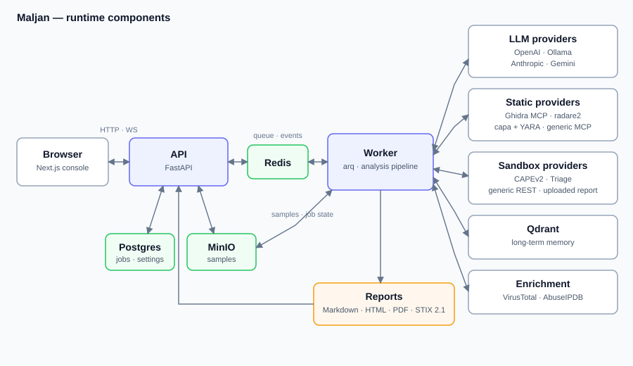

# Architecture

Maljan is a FastAPI service, an arq worker and a Next.js console over Postgres,
Redis and MinIO. The service owns requests and state; the worker owns analysis
runs and everything an analysis talks to — language models, static analysis
tools, sandboxes, long-term memory and threat-intelligence lookups. This
document describes the components, what happens during a run, and the pieces an
operator can reconfigure.



## Components

| Component | Role |
| :-- | :-- |
| Console (`apps/web`) | Next.js interface: dashboard, analyses, samples, settings. Talks HTTP to the API and subscribes to the job WebSocket. |
| API (`apps/api/app`) | FastAPI application. Authentication, samples, jobs, reports, the audit trail, the settings store and the probes. |
| Worker (`apps/api/app/worker`) | arq process. Takes an analysis job, runs the pipeline, writes the report and publishes progress events. |
| Core (`src/maljan`) | The analysis package: agents, the LangGraph pipeline, the deterministic evidence layers, the provider layer, memory and reporting. |
| Postgres | Users, samples, jobs, reports, audit rows and the settings store. |
| Redis | The arq queue, the per-job event stream, and rate-limit counters. |
| MinIO | Sample bytes, in the bucket named by `MINIO_BUCKET`. |
| Qdrant | Long-term memory: past analyses and family fingerprints as vectors. |
| Tool servers (`services/`) | stdio MCP sidecars bound to one agent each: PCAP tooling for the network analyst, VirusTotal and AbuseIPDB for the judge. |

## Request and job lifecycle

1. The console authenticates and uploads a sample. The API streams it through
   `UPLOAD_TEMP_DIR`, hashes it, stores the bytes in MinIO and the metadata in
   Postgres, and writes an audit row.
2. `POST /api/v1/jobs` creates the job row and enqueues `run_analysis` on arq
   under the same identifier, so the queue job and the database row cannot
   drift apart. An optional `config` object may override a handful of pipeline
   values, including `profile`, which is validated against the profiles the
   store actually holds.
3. The worker takes the job, re-reads the configuration from the settings
   store, downloads the sample from MinIO and mirrors it into `SAMPLES_DIR`
   so the Ghidra container can read it through its bind mount.
4. The pipeline runs. Each stage publishes an event on the Redis channel for
   that job; the API relays it to the console over
   `/ws/analysis/{job_id}`. Publishing is best effort — the database row is
   always written first, so a Redis outage costs progress updates, never the
   record.
5. The report is written to Postgres and becomes available under
   `/api/v1/reports/...` in every rendering the report service supports.
6. Threat-intelligence enrichment runs afterwards as its own job, so it never
   delays the verdict.

## Format routing

The platform never refuses a sample for its format. The first thing a job does
is read the sample's magic bytes into a file type and a platform
(`src/maljan/extractors/sample_identity.py`), and everything downstream routes
on that answer: which sandbox package or VM profile is asked for, which tools
an analyst is given, which rules the Sigma and YARA layers keep,
which ATT&CK domain a technique id belongs to, and which artefacts the analyst
prompts are told to look for. A format nothing recognises routes to the neutral
path — a raw-byte sweep and a report that says so — rather than to a rejection.
Deterministic code decides the routing; the analysis itself is the agents'
work over whichever tools the operator connected for that format.

## The pipeline

A LangGraph `StateGraph` over one shared state (`src/maljan/pipeline/`). The
analyst stage has two shapes and `parallel_analysts` chooses between them:

```
START
  │
  ├─ parallel_analysts = False  (the default)
  │     static_analyst -> dynamic_analyst -> network_analyst
  │
  └─ parallel_analysts = True
        START fans out to all three, then fans in
  │
negotiation  <-------- revision
  │  (consensus, or the iteration cap)   ^
  └─ no consensus -----------------------┘
  │
judge
  │   inside this node: the evidence summary, the degradation note, then
  │   the STIX 2.1 bundle and the judge's own severity, category and family
  │
report  ->  END
```

Sequential is the default because a single local model server has one slot, and
fanning out three analysts onto it produces queue thrash rather than speed. Set
`parallel_analysts` when each request gets its own slot, as with a hosted API.

Agents exchange structured `AgentISR` objects — claims with an `evidence_ref`
and a confidence — rather than raw text. Objects are built and cached in one
composition root (`src/maljan/core/container.py`), and agents are discovered
through the `@register_agent` decorator in `src/maljan/agents/registry.py`.

The organising rule is that the agent decides and the code says what is wrong
with the decision. No component rewrites a claim, a technique id, a confidence,
a severity, a category or a family behind the producer's back; a finding is put
back to the producer as feedback and it gets one turn to fix it. What it will
not fix stays on the record. `tests/unit/test_no_silent_overrides.py` enforces
this by scanning the source for the writes it forbids.

## Validation loops

`src/maljan/pipeline/validation.py` is where a wrong answer is dealt with. A
`Violation` carries a code, a message written for the producer to read, and the
path it applies to. `retry_with_feedback` appends the model's own answer plus
"Your previous answer had these problems: … Fix them and answer again in the
same format", re-runs once, and *returns* whatever is still wrong rather than
raising it.

Two producers use it:

* **Analysts** (`agents/base_agent.py`) — `validate_isr` reports a technique id
  the ATT&CK catalogue does not have (with up to three suggestions from
  `tools.knowledge.resolve_technique`), a confidence outside `[0, 1]`, and a
  claim citing no evidence. An id that survives the retry keeps the analyst's
  spelling and is flagged `technique_id_valid=False`; the report, the STIX
  minting step and the FP linter read the flag.
* **The judge** (`agents/judge_agent.py`) — `validate_verdict_bundle` reports an
  indicator whose pattern names a value no tool in the run saw, an
  attack-pattern with an unresolvable id, a severity outside the enum, and a
  family named with no evidence ids. An ungrounded indicator that survives the
  retry is dropped, because a STIX consumer has no way to read a caveat — and
  recorded, because the false positive is a fact about the run.

What the judge decides is the judge's: `severity` (with its rationale),
`malware_category` and `family` come back on the bundle under
`x_maljan_assessment` and the report prints them as answered. A severity nobody
assessed prints as "not assessed" rather than defaulting to Informational; a
family the judge could not cite evidence for is kept and flagged unverified
rather than silently zeroed.

Two metrics record the outcome:

* `run_summary.validation` — how many feedback retries the run spent, a count
  per violation code, and every finding that stayed unresolved with the agent
  that owns it.
* `run_summary.corroboration` — per technique id, the sources that named it:
  analysts by name and tools by tool name. A count of distinct sources, not a
  combined confidence. The same collection builds the judge's evidence-summary
  block, so the metric and what the judge read cannot disagree.

A degraded run is not capped. The judge is told in the prompt why the run is
thin — no sandbox report, an analyst that failed, a container nothing could
open — and sets its own confidence; the report header states the same reasons.

## Agents and profiles

Four agent definitions ship built in: `static`, `dynamic` and `network`
analysts, and the `judge`. Each definition carries its role, whether it is
enabled, the tools it may call and — for an analyst — the static provider it
reads through. A profile names which analysts run and in which order; the
built-in `default` profile is `static, dynamic, network`, which is the
architecture this project measured itself on.

Both are editable from Settings → Agents and pipeline. A custom agent runs as a
`ConfigurableAnalyst` with the tools its definition names; a profile may not
list an analyst twice, may not include the judge, and may not name a disabled
analyst while it is the active profile.

A second profile ships built in: `measurement`. It runs the same three analysts
with every tool server withheld and the static provider forced to `none` — the
baseline for what the ensemble contributes on its own. It is a profile rather
than three tool-free clones of the definitions, so the agents it measures
cannot drift from the ones `default` runs.

## Built-in tool servers

Every analysis capability the pipeline used to run in-process is also a tool an
agent may call. Four stdio sidecars ship built in, each a single-file `FastMCP`
server under `services/`, launched with the same interpreter the worker runs on
and registered in `_builtin_servers()`:

| Server | Bound to | How | Offers |
| :-- | :-- | :-- | :-- |
| `analysis` | `static` | definition `tools` | Identity and hashes, strings and typed IOCs, PE/ELF/Mach-O/APK structure, archive and document inspection, payload carving, YARA, Sigma and capa. |
| `knowledge` | every analyst and the judge | definition `tools` | ATT&CK lookup, validation and ranking, the API-behaviour catalog, the LOLBin table, family and prior-case retrieval. |
| `network` | `network` | role binding | DNS, HTTP and packet views of a capture, plus the whole-capture summary. |
| `threatintel` | `judge` | role binding | VirusTotal and AbuseIPDB reputation lookups. |

The two tool sidecars carry `agents: []` and are bound only by the `ToolRef`s
in the agent definitions, so the definition's tool list is the single binding
and a clone that drops a reference really loses those tools. Both bindings are
composed the same way for every agent — role-bound servers first, then the
definition's references, under one collision rule.

The implementations live in `src/maljan/tools/` as plain functions — explicit
arguments, JSON-serialisable returns, no `Settings` access — so the sidecar is
a `@mcp.tool()` wrapper and nothing more, and the same code backs an in-process
caller. Two rules hold across all of them: they report facts rather than
verdicts (a packer section name is a match, not "packed"), and an optional
dependency that is missing costs one tool's answer, never the server.

The `dynamic` analyst's tools are the exception: its sandbox report is already
in the worker's memory, so `ToolRef(kind="sandbox")` resolves to in-process
tools over that report (`src/maljan/providers/sandbox_tools.py`) with no
transport to open — the process tree, the network activity, the sandbox's own
signatures, the files written, the registry keys touched, the API-call
histogram, the mutexes held, the services and scheduled tasks arranged, the
platform channels, and a bounded reader for any section the rest do not model.

A tool server reached over HTTP does not share the worker's filesystem, so it
is handed the sample rather than a path to it; a stdio sidecar is handed the
path. See the remote-delivery section of
[configuration.md](configuration.md).

## Providers

The provider layer (`src/maljan/providers/`) puts one interface in front of
each class of external tool, so the choice is configuration rather than code.

- **LLM** — `openai`, `anthropic`, `ollama`, `gemini`. Each has its own
  credentials, endpoint and model names; only the selected provider is used.
  Separate model choices exist for the analysts and for the judge.
- **Static** — `ghidra` (Ghidra MCP), `r2` (radare2 MCP), `capa_yara`,
  `generic_mcp` for a server of your own, and `none`.
- **Sandbox** — `mock` (the default), `cape2`, `triage`, `upload` for a report
  produced elsewhere, and `rest`, a mapping-driven adapter for a sandbox
  Maljan has never heard of.
- **Tool servers (MCP)** — additional servers declared in the settings store,
  each with the tools it is allowed to expose and the agents allowed to call
  it.

Every provider that can be reached over the network has a probe behind a Test
button in the console; see [configuration.md](configuration.md).

## Memory

Past analyses and family fingerprints are vectorised and stored in Qdrant, and
retrieved by similarity during a run (`src/maljan/memory/`). The collections,
the neighbour count and the Qdrant endpoint are settings. The ATT&CK corpus and
its embeddings are cached on disk; on the compose stack that cache is a named
volume, because rebuilding it costs the judge node about a gigabyte of resident
memory and a minute and a half on the first analysis.

## The evidence ledger

Every tool call an analysis makes is written down as it happens. The tool loop
wraps each tool, times the call, records the arguments, the outcome and the
result — parsed when the tool answered JSON — and hands the answer back to the
model with the entry's id stamped on the front:

```
[ev_0007]
{"machine": 332, "sections": [...], "imports": [...]}
```

Ids (`ev_0007`) are monotonic across the whole job, and the judge's own calls —
threat intel on a disputed indicator, a knowledge lookup — go through the same
recorder under `agent="judge"`, so a verdict that leans on one can cite it.
That stamp is what makes a report checkable: the model can cite the call it read
a fact from, a report section lists the entries it was built from, and `GET
/api/v1/jobs/{id}/evidence` serves those entries back.

Two bounds keep the ledger from becoming the thing it records. Each output is
trimmed on the way in, and each agent gets a byte budget
(`report.evidence_budget_bytes`); past the budget an entry keeps its arguments,
its outcome and its timing and drops its output, and the count of what was
dropped reaches the run summary. The ledger lands in the pipeline state as an
append-only list and is persisted with the report, in the same transaction.

## The findings block

An analyst may end its answer with a fenced `maljan-findings` block holding
JSON: `artifacts` (a kind, a label, and either a value or columns and rows) and
`findings` (a title, techniques, a confidence), each naming the ledger ids it
came from. It is optional in both directions — an analyst that emits nothing
loses no claim, and the CLAIM/EVIDENCE/CONFIDENCE/TECHNIQUE contract the
negotiation runs on is untouched. What the block adds is the *table* a claim
cannot carry: the import list, the permission set, the endpoints.

Anything that fails validation is dropped and counted rather than repaired, and
the block is stripped before the prose reaches the transcript or the report.

## Reporting

Every run emits a structured `MalwareReport` (`src/maljan/reporting/`), and it
is assembled from what the run gathered rather than recomputed beside it:

* `reporting/ledger_report.py` turns the ledger into `report.sections` — a
  builder per known tool, generic fallbacks (a JSON object becomes a key/value
  block, an array of objects a table, anything else a capped text block) for a
  tool nobody has written yet, the agents' artifacts grouped by kind, and their
  findings as one table. Every section carries the entry ids behind it.
* `reporting/ledger_projection.py` fills the typed blocks — `static`,
  `dynamic`, `network`, `persistence` — from the same ledger, because several
  layers still read them. A tool that was never called leaves its block empty
  and every layer downstream of it degrades to silence.
* Identity comes from `identify_file` and `hashes` when they ran, and from the
  routing minimum (format, platform, and hashes the builder computes) when they
  did not.
* Severity, malware category and family attribution are the judge's, read off
  `x_maljan_assessment` on its bundle. Nothing in the builder computes a
  replacement — the CVSS-shaped sum that used to print a score out of ten was
  arithmetic over constants chosen in the builder, by code that had read no
  evidence.
* The capability matrix is a projection of the judge's technique list and the
  analysts' claims, carrying each source's own confidence unadjusted.
* `run_summary.evidence` counts the calls and `run_summary.sections_without_
  evidence` counts the sections that can name neither an entry nor a finding —
  the number that says whether the report is standing on anything.
* `qa/fp_linter.py` runs last and reports; it changes nothing. Its findings land
  in `run_summary.fp_warnings`, including C6 (a section or TTP row with nothing
  citable behind it) and C7 (a technique id the validation loop could not get
  resolved).

The API renders the report as Markdown, HTML and PDF, and exposes the STIX 2.1
bundle, a MITRE view, the extracted indicators, the detection signatures that
fired and a timeline. Post-hoc enrichment fills VirusTotal, AbuseIPDB, WHOIS and
GeoIP reputation into the indicator set after the verdict has shipped.
