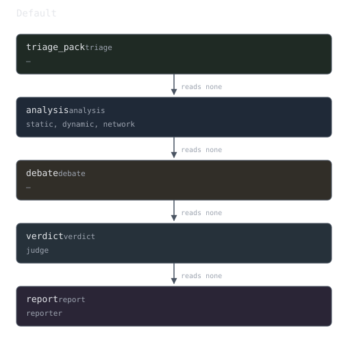
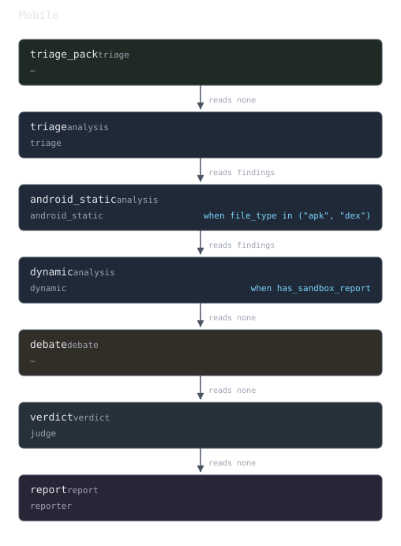
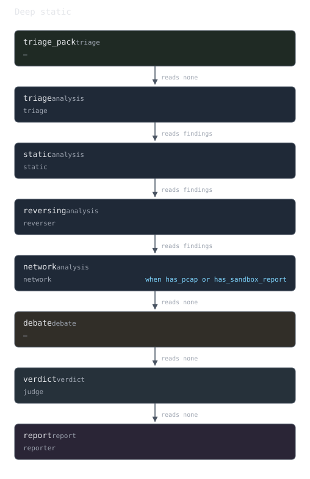
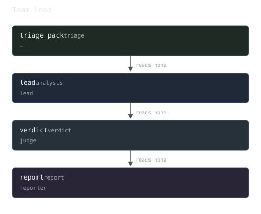

# Architecture

Maljan is a FastAPI service, an arq worker and a Next.js console over Postgres,
Redis and MinIO. The service owns requests and state; the worker owns analysis
runs and everything an analysis talks to — language models, static analysis
tools, sandboxes, long-term memory and threat-intelligence lookups. This
document describes the components, what happens during a run, and the pieces an
operator can reconfigure.


## Components

| Component | Role |
| :-- | :-- |
| Console (`apps/web`) | Next.js interface: dashboard, analyses, samples, settings. Talks HTTP to the API and subscribes to the job WebSocket. |
| API (`apps/api/app`) | FastAPI application. Authentication, samples, jobs, reports, the audit trail, the settings store and the probes. |
| Worker (`apps/api/app/worker`) | arq process. Takes an analysis job, runs the pipeline, writes the report and publishes progress events. One job at a time. |
| Enrichment worker (`apps/api/app/worker/enrich_worker.py`) | A second arq process on a queue of its own, for the post-verdict reputation lookups. Two at a time by default, and off unless the deployment turns it on (see below). |
| Core (`src/maljan`) | The analysis package: agents, the LangGraph pipeline, the deterministic evidence layers, the provider layer, memory and reporting. |
| Postgres | Users, samples, jobs, reports, audit rows and the settings store. |
| Redis | The arq queue, the per-job event stream, and rate-limit counters. |
| MinIO | Sample bytes, in the bucket named by `MINIO_BUCKET`. |
| Qdrant | Long-term memory: past analyses and family fingerprints as vectors. |
| Tool servers (`services/`) | stdio MCP sidecars bound to one agent each: PCAP tooling for the network analyst, VirusTotal and AbuseIPDB for the judge. |

## Request and job lifecycle

1. The console authenticates and uploads a sample. The API streams it through
   `UPLOAD_TEMP_DIR`, hashes it, stores the bytes in MinIO and the metadata in
   Postgres, and writes an audit row. The object store's client is synchronous,
   so every call into it — the sample, an uploaded sandbox report, a delete —
   is made from a worker thread: a hundred megabytes sent from the event loop
   is a hundred megabytes during which the process answers nothing else, its
   own health check included.
2. `POST /api/v1/jobs` creates the job row and enqueues `run_analysis` on arq
   under the same identifier, so the queue job and the database row cannot
   drift apart. An optional `config` object may override a handful of pipeline
   values, including `profile`, which is validated against the profiles the
   store actually holds.
3. The worker takes the job, re-reads the configuration from the settings
   store, downloads the sample from MinIO and mirrors it into `SAMPLES_DIR`
   so the Ghidra container can read it through its bind mount.
4. The pipeline runs. Each stage publishes an event on the Redis channel for
   that job; the API relays it to the console over
   `/ws/analysis/{job_id}`. Publishing is best effort — the database row is
   always written first, so a Redis outage costs progress updates, never the
   record.
5. The report is written to Postgres and becomes available under
   `/api/v1/reports/...` in every rendering the report service supports.
6. Threat-intelligence enrichment runs afterwards as its own job, on the
   enrichment worker's queue, so it delays neither the verdict nor the next
   analysis.

### The two worker processes

    uv run arq app.worker.analysis_worker.WorkerSettings
    uv run arq app.worker.enrich_worker.EnrichmentWorkerSettings

The analysis worker reads arq's default queue and runs **one job at a time**:
two analyses on one host would share a model, a sandbox and a memory budget
sized for one. The enrichment worker reads `arq:queue:enrichment` and runs two
at a time (`ENRICHMENT_MAX_JOBS`), because a reputation lookup waits on
somebody else's HTTP.

They were one process, and the single slot was the cost: a measured enrichment
spent 451.98 s at VirusTotal while the next analysis sat `pending` for 4 m
33 s. Nothing about that lookup needed the rule it was subject to.

**Which one a deployment gets.** `api.enrichment_dedicated_worker` decides, and
it ships **off**: a release that is taken and run unchanged keeps one process,
and nothing stops working because a process nobody started is missing.

On that one queue the enrichment gets out of the way rather than merely waiting
its turn. arq pops by score, so an enrichment queued a second before an
analysis would otherwise run first and the analysis would wait for all of it —
452 s in the run this was filed for. When the task starts there it reads the
analysis queue first, and if anything but another enrichment is waiting it
re-enqueues itself 60 seconds later and returns having done nothing. The total
deferral travels in the job's own arguments and is capped at 30 minutes, after
which it runs whatever is queued: an analysis waits for at most one enrichment
per cap window, and a steady stream of analyses can never starve the
enrichment. An enrichment already running is never interrupted — that is what
the second worker is for. The compose stack runs the second
worker and sets `ENRICHMENT_DEDICATED_WORKER=true` beside it, which is the
default the setting falls back to; an operator's saved value wins over both.
Turn it on wherever the second process actually runs.

When it is on and nothing is reading the enrichment queue — arq's own
per-queue health key is absent one health interval after the analysis worker
boots — the worker logs one warning naming the queue and the command that
reads it, and `GET /api/v1/system/status` reports `enrichment_worker` as
`down`. Queued enrichments are kept, not dropped: they run when a worker
starts.

The task is registered on both workers so the single-process default has
something to run it, and the nightly `job_events` purge stays on the analysis
worker: one owner per scheduled task. The enrichment worker runs
`ENRICHMENT_MAX_JOBS` (default 2) at a time — more than one because each job
waits on somebody else's HTTP, not many more because they share one VirusTotal
key and one AbuseIPDB key and a provider's rate limit is per key.

### What the worker holds while a run is in flight

No database transaction. The worker opens one session before the models start
— the job row, its sample, the stored settings, any attached sandbox report,
and the move to `running` — and closes it again before the pipeline is built.
The run's writes open sessions of their own: the event feed's batches as they
fill, and one transaction at the end for the report, the agent findings, the
evidence ledger, the transcript and the completion, which go together because
the report's sections cite the ledger's ids.

A session held for the length of an analysis is a backend sitting `idle in
transaction` for as long as the run takes. One was measured at 13 minutes 51
seconds, holding an `AccessShareLock` on `analysis_jobs`, `analysis_reports`
and `runtime_settings`: a migration's `ALTER TABLE analysis_reports` queued
behind it, every read of that table queued behind the ALTER, and
`GET /api/v1/jobs/{id}` timed out for four minutes while `/health` answered in
milliseconds. The enrichment task follows the same rule — it reads the
report's payload, closes, spends as long as the reputation lookups take
(452 s on one measured report), and opens a second session to write the
result.

A failed run records its failure through a session of its own. The session the
run was writing through is the one most likely to be unusable — a terminated
backend leaves every statement on it raising `PendingRollbackError` — and that
is how a job came to publish its `error` event and still read `running`, with
no error and no `completed_at`, for as long as the worker stayed up. What the
row then says is the class of the exception and the id of the log entry
holding the rest: `error_message` is a field of `JobResponse`, so an
exception's own message put there is published, and a failure names a path or
a connection string as readily as anything else. The exception to that is
`StatedFailure` and its subclasses — the failures this module words itself,
from constants and from ids this system issued — whose sentence is the answer
and travels whole: an absent analysis, an attached report that belongs to
another sample, a sandbox provider that cannot take one.

### Who owns a running job

The worker that is running it says so, and keeps saying so. While
`run_analysis` runs it holds `maljan:job-owner:<job id>` with its own id in it,
for 90 seconds, refreshed every 30 by a task of its own; the key is dropped on
success, failure and cancellation alike. A `running` row whose key is absent is
a row nobody is working on.

Neither of arq's own keys can answer that question. The in-progress claim
(`arq:in-progress:<job id>`) is written once and lives for the job timeout, so
it outlives the process that wrote it by hours; the health key is queue-wide
and lives 31 seconds past its last write, so a worker killed a moment ago still
looks alive — and a restarted container looks at it within seconds of that
kill, which is exactly the case the sweep exists for.

The sweep therefore runs on its own clock rather than at the instant of
startup: one owner TTL after the worker boots, so a crashed worker's last
heartbeat has certainly expired, and every ten minutes after that — which is
also what reaches a job a still-running worker gave up on, the case that left
one job reading `running` for an hour. Two rules point the other way, both
towards leaving a job alone: a row younger than one TTL is left for the next
pass, because a worker may have claimed it a moment ago, and a job this process
is running is never swept whatever Redis says. If Redis cannot be read, nothing
is touched and the reason is logged once, because ownership cannot be
established without it and guessing costs somebody else's run.

A run that ends in `CancelledError` is told apart by the cancel flag the API
writes when somebody presses stop (`analysis:{job_id}:cancel`, which the
heartbeat also polls). The flag is there: the operator asked, so the task
writes `cancelled` on the row through a session of its own, whether the
heartbeat noticed or the cancel landed between two of its polls. No flag: arq's
`job_timeout` or a worker shutting down, where the process is going away and
writing a row races its own teardown — the heartbeat goes with it, so the next
sweep pass marks the job failed within ten minutes.

### What a request holds while it waits on somebody else

Nothing either. A request-scoped session is in a transaction from its first
statement — on an authenticated route, the dependency that resolved the caller
— and stays in it until the handler returns, so a handler that then waits on a
third party leaves a backend `idle in transaction` for the length of that
wait. The routes that do wait end the read first, through
`database.end_read_transaction`: the three probes (`/settings/test/{probe}`,
`/test/mcp`, `/test/agent`, up to five minutes at a model endpoint), the
VirusTotal registration, and the long-term-memory purge, which scrolls a whole
Qdrant collection. The session stays usable; the next statement opens a
transaction of its own.

The WebSocket route holds no session across the stream at all. The handshake
reads the account and the job's owner inside a session, closes it, and then
accepts or rejects; a resume reads one page of the feed per session and sends
it after that session has closed, because the send goes at the client's pace
and a thousand frames to a slow reader is not something to hold a transaction
across. The account re-check on the clock opens a session of its own each
time.

## Format routing

The platform never refuses a sample for its format. The first thing a job does
is read the sample's magic bytes into a file type and a platform
(`src/maljan/extractors/sample_identity.py`), and everything downstream routes
on that answer: which sandbox package or VM profile is asked for, which tools
an analyst is given, which rules the Sigma and YARA layers keep,
which ATT&CK domain a technique id belongs to, and which artefacts the analyst
prompts are told to look for. A format nothing recognises routes to the neutral
path — a raw-byte sweep and a report that says so — rather than to a rejection.
Deterministic code decides the routing; the analysis itself is the agents'
work over whichever tools the operator connected for that format.

## The pipeline

A LangGraph `StateGraph` over one shared state (`src/maljan/pipeline/`). The
triage pack runs first; the analyst stage after it has two shapes and
`parallel_analysts` chooses between them:

```
START
  │
triage_pack   the deterministic tools, run by the pipeline, one ledger entry each
  │
  ├─ parallel_analysts = False  (the default)
  │     static_analyst -> dynamic_analyst -> network_analyst
  │
  └─ parallel_analysts = True
        START fans out to all three, then fans in
  │
negotiation  <-------- revision
  │  (consensus, or the iteration cap)   ^
  └─ no consensus -----------------------┘
  │
judge
  │   inside this node: the evidence summary, the degradation note, then
  │   the STIX 2.1 bundle and the judge's own severity, category and family
  │
report  ->  END
```

Sequential is the default because a single local model server has one slot, and
fanning out three analysts onto it produces queue thrash rather than speed. Set
`parallel_analysts` when each request gets its own slot, as with a hosted API.

### The triage pack

Before any analyst starts, the pipeline runs the deterministic tools itself
(`src/maljan/pipeline/triage_pack.py`) and writes each result to the evidence
ledger as an ordinary entry under `agent="pipeline"`, `server="pipeline"`. A
human analyst runs the same dozen commands on every sample before opening a
disassembler, and the live runs showed the local model rarely asks for any of
them; a fact a model may or may not ask for is not a fact a run can rely on.

The pack is the same code the `analysis` sidecar serves, called in-process, in
a fixed order so the ids a sample produces are the same from one run to the
next: `identify_file` and `hashes`; `signing_info` for the routed format alone
(Authenticode for a PE, with the signer's subject, issuer and thumbprint read
out of the certificate table and no chain verdict claimed; the APK signing
block for an APK; `LC_CODE_SIGNATURE` for a Mach-O; and for anything else the
fact that it has no signing scheme);
the format tool the routed type selects (`pe_info`, `elf_info`, `macho_info`,
`apk_info`, `document_info` or `archive_list`, which carry the section
entropies, the packer signature hits and the import rows); a `strings` head
capped by `triage.strings_head` and `iocs_from_file`; `yara_scan`, `capa`
under the static provider's budget and, when a sandbox report exists,
`sigma_match_sandbox`; `api_capability` over the import set (asked about the
routed format's own platform, and a format the catalogue has no block for —
a Mach-O, an APK — is not asked, so it yields no profile and no rule hit)
and `lolbin_lookup` over the sandbox's command lines; the sandbox
projections at summary level (processes, network, signatures, dropped
files, channels) and `pcap_summary` when a capture was fetched; one reputation
lookup on the sha256 (`get_file_report` on `virustotal` when it is enabled,
else `check_hash` on `threatintel`), made through the tool server exactly as
an agent's call is and recorded under that server; `function_matches` when
a Qdrant function-hash store and a provider that hashes functions are both
present; and, last, for a PE, `floss`: FLOSS's decoded, stack and tight
strings, recovered by emulation (the sample is never executed) through the
same `tools.emulated_strings` function the sidecar's `floss` tool serves — its
pinned build, 600 s wall clock and 4 GiB address-space limit — with the
`analysis` server's environment (so `MALJAN_FLOSS_PATH` there is honoured) and
a directory inside the job's staging directory that the job's teardown
removes. The entry keeps up to 200 rows. It is last so the ids issued before it
are the ids they were before it existed. Without a build the entry says so,
with the remedy, and is not a failure; a run stopped by its wall clock or its
memory limit is a failed entry whose line says which.

The pack states facts and draws no conclusion, and it never fails a job: a
tool that raises or answers with an error is an entry with `ok=False` and a
degradation reason `triage.<tool>_failed`, the next tool runs, and a
reputation lookup that has no enabled server is an entry saying so rather than
a silence. Four of its facts — `has_signature`, `reputation_malicious`,
`yara_hits`, `capa_hits` — are readable by every later stage's `when`
condition as `triage.<field>`, and `run_summary.triage` records how many
entries it wrote, how many failed and how long it took. It declines, with the
reason recorded, when `triage.enabled` is off, when the stage withholds the
built-in tools, or when there is no sample on disk to read. The `measurement`
baseline has no triage stage at all.

**Every model reads it.** `triage_pack.render_pack` turns the entries into one
line each — `[ev_0001] identity: pe windows, 4,486,656 bytes, …`,
`[ev_0003] signature: none`, `[ev_0007] yara: 2 hits of 30 rules (…)`,
`[ev_0008] capa: 6 capabilities, ATT&CK T1027, T1055 (rule-asserted)`,
`[ev_0017] reputation: VirusTotal 31/75 malicious, labels Filisto` — cut at
`reporting.upstream_findings_max_chars` with a last line saying how many
entries were left out and that their full output is a tool call away. The
decoded strings are one line: the counts, then each string quoted as
`"string"@offset` (a decoded string's call site, a stack or tight string's
routine, relative to the image base) grouped by the routine that produced it,
at most 100 strings and 3,000 characters with each string cut at 120; a line
that cut says so, with the reason and the `offset` of the rest, and a line
that would not fit in what is left of the block is rendered shorter rather
than dropped. On the reference loader it carries all 81 strings. Under
the heading *Facts established before analysis (ledger ids in brackets; cite
them)* the block leads every analyst's first human turn (analysis and
revision alike), the mediator's and the verdict's human turns, the narrative
prompt and every composer section. The report's identity block and signature
rows come from the same entries when no model cited them. And because every
agent was shown the pack, the pack's ids are citable by every agent:
`isr.ungrounded_technique` no longer exempts an analyst whose own ledger is
empty when a pack is present — only a run with nothing citable at all (the
measurement baseline) is exempt.

The reputation line states the labels the answer carries. VirusTotal's own
MCP server answers with `detections`, one result label per engine that
detected the file, and no popular threat classification; the line counts those
labels exactly as written and names them with how many engines gave each,
most first and then in the answer's order, at most twenty, with the number of
distinct labels left out — `VirusTotal 52/75 malicious, 52 detection labels,
47 distinct (engines per label, most first, 20 shown): Gen:Variant.… ×4, …
(+27 more distinct labels)`. Nothing is merged or normalised and no family is
read out of them; an answer that does carry a popular classification still has
its suggested label and names listed as `labels …`.

**The run-state block.** `pipeline/run_state.py` derives a dozen lines from the
state — the sample, the identity, hashes, signature and reputation lines out
of the pack, which stages ran or were skipped and why, how many ledger entries
exist and which tools failed, and the steps and seconds a tool loop has left —
and puts them in the system turn between `=== RUN STATE … ===` markers. It is
regenerated on every model turn of a tool loop (the executor's prompt hook
rewrites the budget line) and replaced rather than appended, so a prompt
carries exactly one block; the forced-synthesis trim keeps the system turn and
the first human turn, so neither the block nor the pack is ever what gets cut.
It is read-only to the model: nothing a model says is written into it.

Agents exchange structured `AgentISR` objects — claims with an `evidence_ref`
and a confidence — rather than raw text. Objects are built and cached in one
composition root (`src/maljan/core/container.py`), and agents are discovered
through the `@register_agent` decorator in `src/maljan/agents/registry.py`.

The organising rule is that the agent decides and the code says what is wrong
with the decision. No component rewrites a claim, a technique id, a confidence,
a severity, a category or a family behind the producer's back; a finding is put
back to the producer as feedback and it gets one turn to fix it. What it will
not fix stays on the record. `tests/unit/test_no_silent_overrides.py` enforces
this by scanning the source for the writes it forbids.

## Validation loops

`src/maljan/pipeline/validation.py` is where a wrong answer is dealt with. A
`Violation` carries a code, a message written for the producer to read, and the
path it applies to. `retry_with_feedback` appends the model's own answer plus
"Your previous answer had these problems: … Fix them and answer again in the
same format", re-runs once, and *returns* whatever is still wrong rather than
raising it.

Two producers use it:

* **Analysts** (`agents/base_agent.py`) — `validate_isr` reports a technique id
  the ATT&CK catalogue does not have (with up to three suggestions from
  `tools.knowledge.resolve_technique`), a confidence outside `[0, 1]`, and a
  claim citing no evidence. An id that survives the retry keeps the analyst's
  spelling and is flagged `technique_id_valid=False`; the report, the STIX
  minting step and the FP linter read the flag.

* **The judge** (`agents/judge_agent.py`) — `validate_verdict_bundle` reports an
  indicator whose pattern names a value no tool in the run saw, an
  attack-pattern with an unresolvable id, a severity outside the enum, and a
  family named with no evidence ids. An ungrounded indicator that survives the
  retry is dropped, because a STIX consumer has no way to read a caveat — and
  recorded, because the false positive is a fact about the run.
  `verdict.unstated` asks for the verdict when the bundle states none, and
  `verdict.assessment_conflict` asks which of two answers was meant when the
  stated verdict and the rest of the assessment disagree — see *The verdict is
  what the judge states* below. Two symmetric
  rules ask what a verdict over zero analyst claims rests on:
  `verdict.unsupported_benign` asks for the entry that establishes Benign (a
  signature is the usual one) and `verdict.unsupported_malware` for the entries
  that establish Malware (a reputation entry, a rule hit); either way the
  alternative offered is Suspicious with an inconclusive rationale, the judge
  is asked once, and the second answer is kept as given. Both rules run over
  the bundle that is actually reported, on every way the round can end — a
  bundle, a malformed answer the retry fixed, prose the model stood by twice,
  JSON that is not a bundle, and no answer at all. Where the loop ran them they
  were fed back once; on the endings that produce a verdict out of text nothing
  is asked again and what they find is recorded in `run_summary.validation`
  beside the verdict it describes, once each.

* **The report's prose** (`reporting/narrative_agent.py`, `reporting/composer.py`)
  — the shape of the answer, a capability the run does not establish
  (`narrative.ungrounded_capability`), and a bracketed citation that is not an
  evidence id the answer was shown (`report.citation_not_evidence`): a prompt
  block's heading such as `[BINARY FACTS]`, a source's name, or an `ev_` id
  that was not in its prompt. The citable ids are the ones the prompt carries
  (the pack's, the ids in the analysts' claims), and the question's sentence
  names them. An ATT&CK or MBC id in brackets (`[T1027]`, `[C0027.009]`) is an
  identifier, not a citation, and a markdown link is neither. A citation or an
  over-claim that survives the retry is printed as written and recorded
  unresolved; only a broken shape costs the section.

* **A judge that did not answer with a bundle** — the pipeline builds one from
  whatever text there was, and that bundle states its verdict in
  `x_maljan_fallback_verdict` rather than implying it through its objects. The
  verdict is `extracted` when it was read out of the judge's own text and
  `pipeline` when there was nothing to read, which is what a timeout leaves; a
  verdict that is not Malware carries no `malware` object, and the record of
  the degraded path travels on a note instead. `pipeline.outcome
  .decide_from_bundle` reads the statement and counts nothing. Before this the
  fallback bundle carried a `malware` object unconditionally, so the bundle's
  shape decided the verdict: a signed sample with a clean reputation entry, no
  analyst claim and no technique was reported as Malware because the judge
  timed out, while the extraction in the same run had read "Suspicious" out of
  the text. Such a verdict also carries no confidence — see
  `verdict_fallback` below.

### The verdict is what the judge states

`x_maljan_assessment.verdict` is the judge's answer to the question the report
leads with, in the vocabulary `schemas/judgement.VERDICT_VALUES` fixes:
Malware, Suspicious or Benign. `pipeline.outcome.decide_from_bundle` reads it,
after `x_maljan_fallback_verdict` and before anything else. The object set of a
bundle illustrates the decision; it does not make it.

It used to. A signed, 0/74-clean PuTTY was published as `Malware, confidence
1.0` because the bundle carried a `malware` object, while the judge's own
severity was `Informational`, its category `legitimate-utility` and its
rationale read *"the 'malware' classification is used here strictly as a
container for the object type in STIX, but the assessment confirms it is
benign"*. The contradiction was detected, fed back once, survived — and the
shape-derived verdict was published over the judge's own words.

The judge is shown the whole answer as a skeleton, with
`x_maljan_assessment` beside `objects` and the three accepted words written
where the verdict is asked for. It used to be asked for in a bullet among ten
others, with the STIX bundle framing around it and *"Return ONLY a valid JSON
STIX 2.1 Bundle"* last — and a bundle is `{type, id, objects}`, so a model that
had read the spec left the extension out. The default model omitted the block
entirely on its first attempt in three runs of three and supplied it on the
retry; a smaller model wrote it inside `objects[0]` in three of three, which
costs no retry because a misplaced block is moved. Prompt text only: nothing in
this pipeline writes a verdict.

The STIX rules around it ask the judge for what the judge decides and agree
with the checks that read its answer. An attack-pattern names its technique in
`external_references`, and a behaviour with no id goes in `severity.rationale`
— the prompt used to say *"Omit technique ID if unsure"*, which is exactly what
`attck.missing_id` then asks about, and that code took the judge's one retry
in ten of the twenty-four stored runs that retried. Ids are labels (see *The
published ids are the platform's*), `created`, `modified`, `spec_version` and
`valid_from` are left out because they are stamped after the answer — ids and
stamps were about two fifths of what the judge wrote for its objects, output a
small reply budget runs out on — and a relationship credits sources by the
names the evidence summary gives them, which is what `stix.credit_without_claim`
reads.

The statement is read three ways, not two, and `pipeline.outcome.StatedVerdict`
carries the difference: the judge wrote a word this pipeline knows, it wrote a
word this pipeline does not, or it wrote nothing. Only the third is a question
the object set may answer.

`normalise_verdict` is what "knows" means, and it is the one reading in the
tree, shared with the report builder that renders a decision. The whole value
has to *be* one of the three words once whitespace, case and the decoration a
model wraps a word in are taken off — `Malware.`, `**Benign**`, `"Suspicious"`.
Nothing else is interpreted. A question mark is not decoration and is not
stripped: `Malware?` is doubt, and reading doubt as the confident word is the
fault this rule exists to close.

It was a prefix match, which is the right rule for the builder — whose input
the pipeline has already reduced to one of three words — and a dangerous one
for free model text, because a prefix cannot see what follows the stem:
`malware-free`, `Malware (false positive)` and `malwarebytes detected nothing`
all read as Malware, and `Benignware is unlikely; malware` as Benign. The
published verdict was the inverse of what the judge wrote, with no code, no
feedback turn and the judge's own confidence printed beside it.

The field's annotation is `Any` for the same reason its vocabulary is not a
`Literal`: a judge answering `["Malware"]` or `1` to a field with three allowed
values used to fail `Bundle.model_validate` and cost the run every object it
had. A value that is not text is stated and unrecognised like any other, shown
back as its own compact JSON.

Four rules follow from the statement:

* **Unstated is recorded, not guessed at.** A bundle whose field is absent is
  still read by its objects, for stored runs and for a model that omitted it,
  and `verdict.unstated` is fed back once and recorded when it survives. A
  bundle this pipeline built out of text states its own verdict and is not
  asked for a second one.
* **Unrecognised is asked about, and the objects stay out of it.** The run
  publishes `INCONCLUSIVE_VERDICT`, the judge's own answer is quoted in a
  degradation reason the header prints directly under the verdict, no
  confidence is published, and `verdict.unrecognised` asks once for one of the
  three words, quoting what the judge wrote. The severity and category
  conflict rows are silent for that turn, and correctly: there is no stated
  verdict for them to disagree with, and they return the moment the retry
  states one.
* **The conflict check compares the statement with the rest.** The severity
  rating (Malware over Informational, Benign over High or Critical), the
  category (a Malware verdict whose category says the sample is legitimate),
  and the presence of a `malware` object under a Benign verdict — one
  `verdict.assessment_conflict` row per disagreeing fact, each with its own
  path. It is asked once. When it survives, the **stated verdict is
  published**, the conflict is in `run_summary.validation.unresolved`, and the
  console's header draws both facts on one line.
* **The export declines what contradicts the published verdict.** A `malware`
  object under a Benign verdict is not written into the exported bundle —
  neither the judge's nor one the renderer would mint — and the decline is
  recorded as `stix.malware_object_under_benign`. The relationships that would
  dangle go through the integrity pass that already prunes them. Nothing is
  rewritten: the judge's own bundle is stored with the object in it. The
  indicator carrying the sample's own hash says what the published verdict
  says, through `schemas/judgement.indicator_type_for` and STIX 2.1's
  `indicator-type-ov`: Malware is `malicious-activity`, Suspicious
  `anomalous-activity`, Benign `benign`, and a verdict that mapping does not
  name is `unknown`. It used to claim `malicious-activity` whatever the run
  concluded, which told every blocklist the opposite of the verdict — a
  stronger contradiction than the malware object the same export declines,
  because a consumer blocks on the indicator and reads the objects afterwards.
  An indicator for anything else — a domain, an address, a URL the analysts
  observed — keeps the type it already had (`malicious-activity` when the row
  is marked suspicious, `anomalous-activity` otherwise, and
  `anomalous-activity` for a `file:name` out of the string scan); a Benign run
  can carry them, because a benign sample still talks to hosts, and they are
  exported as they are. A judge-written indicator keeps the type the judge
  gave it, and on one shape the judge is asked about it first: a Benign verdict
  beside an indicator the judge typed `malicious-activity` publishes a value as
  malicious activity under a verdict that says the opposite — on a recorded run
  it was the analysed vendor's own project domain. `stix.indicator_type_contradicts_verdict`
  puts that to the judge once, through the same single retry the other verdict
  checks share, naming the indicator, the verdict's own word and the
  vocabulary's `benign` / `anomalous-activity` / `unknown`, and saying the type
  may be kept. Whatever comes back is published: nothing retypes an indicator
  and nothing drops one. A type the judge keeps stays in
  `run_summary.validation.unresolved` and is printed with the other unresolved
  findings, so a consumer reading the bundle beside the report sees the
  contradiction was raised and kept. The mirror — a Malware verdict beside an
  indicator typed `benign` — is not a contradiction and is not asked about: an
  indicator is a claim about the value it names, and a malicious sample may
  touch something harmless. A summary
  note then has no malware object to be about, so it refers to the indicator
  carrying the sample's own hash, which the cap keeps in a band of its own; a
  bundle holding nothing the note could truthfully refer to emits no note, and
  the summary stays in the report where a reader reads it. STIX requires a
  note's and a report's `object_refs` and forbids an empty one, and a bundle
  that breaks that is rejected whole rather than in part.

The published confidence is `x_maljan_assessment.confidence`, the judge's own
number for the verdict the judge itself stated, and nothing else. It is
published only *with* such a verdict: on the two other paths the verdict is not
the judge's, and the number is about something else. Replaying the PuTTY run's
recorded answer shows what that is worth — it has no `verdict` field, so it
publishes Malware from the objects, `verdict.unstated` survived, and
`overall_confidence` `None` where it used to print the judge's `1.00`. A verdict
the judge stated and put no number on is published with `None` too and the
header says "not assessed"; the analysts' mean is their confidence in their own claims and is
not borrowed for a decision they did not reach.

### A misplaced extension does not cost the bundle

The prompt asks for `x_maljan_assessment` beside `objects`. A model that writes
it *inside* the list used to fail `Bundle.model_validate` outright, and one live
run lost all twenty-five of its objects to a text-extracted verdict twice over.
`agents/judge_postprocess.lift_misplaced_extensions` runs before validation: the
block is moved to the property it belongs to, unchanged, and recorded as
`verdict.assessment_relocated` with the state `resolved` and no retry spent —
there is nothing left for the judge to fix. A top-level block already present
wins, and the inner copy is set aside. Any other item whose `type` is not one
of `schemas/stix_models.BUNDLE_OBJECT_TYPES` is set aside under
`stix.unknown_object` and fed back once. So is an object of a type the bundle
holds that cannot be read as written — a `file` or `process` carrying a
property STIX 2.1 does not define for it, an observed-data carrying the
deprecated `objects` dictionary, a value its model cannot hold — because each
object is read on its own before the bundle is, and one object's failure used
to cost the whole answer to the text fallback. The `file` and `process` models
declare every property the standard defines, so what the judge wrote under a
defined name is kept as written. What is left is validated.

### The published ids are the platform's

An id carries no decision: it only says which object a reference means. The
prompt asks the judge for `<type>--<label>` ids unique in its bundle — a short
label is enough — and `postprocess_judge_bundle` mints every published id: a
random UUID under the object's own type (a technique-derived one for an
attack-pattern) with every `*_ref` rewritten to match. The judge used to be
asked for random UUIDs, which a model cannot produce; it copied
documentation-shaped hex instead, one malware id reached fourteen stored runs
of six samples, and its version digit is one no RFC 4122 UUID has, so the OASIS
validator refused every object that carried or named it.

A label two objects share is not resolved: `duplicate_label_violations` asks
the judge (`stix.duplicate_label`), each object gets its own id, and no
reference naming the label is rewired onto either. The map from each label to
its published id travels with the verdict and is kept, with the judge's own
bundle, in `analysis_reports.judge_stix_bundle`, served at
`/reports/{id}/stix?source=judge` — the bundle every export decline row says an
object "is unchanged in". That bundle is the judge's JSON as the judge wrote
it (`"as_written": true`), not a dump of the platform's models, so it holds
every property the judge wrote. A property the models for its type do not
declare — an indicator's `valid_until` or `kill_chain_phases`, a
relationship's `description`, a malware object's `aliases` — does not reach
the export, and each object that carried one is a recorded
`stix.property_not_carried` row naming the keys. The row is never fed back:
nothing in the judge's answer is wrong, and the retry is not spent on it. A
malware object's `sample_refs` is carried. Feedback names the judge's own positions and labels
(`objects[3] 'indicator--2'`), not positions in the post-processed list, and a
drop maps them back. Nothing is written into a judge object that the judge left
out: an untyped indicator stays untyped, and a malware object without
`is_family`, which STIX requires, is asked about (`stix.is_family_missing`),
and an `is_family` the judge wrote is published as written.

A judge malware object the export declines for a property the standard
requires does not take the judge's relationships with it. The platform's own
sample object stands in for it, and every relationship that named it moves
onto that object unchanged — confidence, basis and credits as the judge wrote
them — so the technique the judge numbered is used by the export's malware
object and published at the judge's number, as the report publishes it.

An indicator indicates the malware object only by an edge somebody made: the
judge's own `indicates` edges, and the sample's hash indicator, whose edge is a
fact the platform owns. Every other indicator — the network and string rows the
renderer mints, a judge indicator the judge related to nothing — is published
related to nothing and listed in the report object's `object_refs`. In STIX
`indicates` says the pattern detects the malware, and a Malware verdict does
not say that of every value the run saw; the same reason types those rows
`anomalous-activity`.

The export names its producer in STIX's own vocabulary: one `identity` for this
platform, `identity_class: system`, under an id derived once
(`stix_renderer.PRODUCER_IDENTITY_ID`) so every export carries the same one,
and `created_by_ref` naming it on every other object — a copy, so the judge's
own bundle is not edited. The report object is typed `malware`. Every stored
export before this carried `software` and `malware-analysis`, neither of them
in its vocabulary, and an identity no object named.

A sandbox's process tree is exported as STIX 2.1 observables: one `process`
per node (pid, command line, `child_refs`), the image each ran from as a
`file` whose id is derived from its name, and an `observed-data` naming them
by `object_refs` with `number_observed: 1` — one run is one observation. The
2.0 form it replaced embedded unnamed processes carrying a `name` 2.1 does not
define and put the process count in `number_observed`; the OASIS validator
could not read it. `tests/unit/reporting/test_the_export_passes_the_official_validator.py`
renders a rich Malware export, a sandbox export and a Benign export through
the real path and fails on any error the validator reports (`stix2-validator`
is pinned at 3.2.0, the last release that ships its schemas; 3.3.1 validates
nothing).

### The technique check

Four parts, all in `pipeline/validation.py` and `tools/knowledge.py`, none of
them a rewrite: the check produces violations and annotations, and the id an
analyst wrote stays the id in the report.

This is a change of method from the tree the paper was evaluated on (tag
`paper-2026-09`). That tree carried a re-grounding pass,
`ATTCKValidator.correct_isr_reports`, which replaced an analyst's technique id
with the alignment index's best candidate whenever the gate disagreed, so the
identifiers in a report were valid because the pass had made them so. Here
what holds by construction is that no invalid id goes unflagged: every id is
checked against the vendored catalogue, and one the catalogue lacks is
reported, flagged `technique_id_valid=False` and kept as written — an invalid
id can be kept, and then it is kept marked. The technique choice is the
model's, made under deterministic challenges: an id
the catalogue does not have, a domain or platform the sample cannot have, an
alignment the index disputes, and a corroboration count that says who else
named the technique. The gate is one of those challenges; it no longer
decides.

1. **Validity** (`attck.unknown_id`, exact). Every id against the vendored
   catalogue. When the catalogue cannot be read the check says so instead of
   answering "nothing unknown": `run_summary.validation.not_run` lists
   `attck.unknown_id` and the run carries a degradation reason.
2. **Domain and platform consistency** (`attck.platform_mismatch`, exact). The
   catalogue's domain and platforms for the id against the routed sample —
   a Windows PE is `enterprise`/Windows, an APK `mobile`/Android, an ELF
   `enterprise`/Linux, a Mach-O `enterprise`/macOS, an unknown platform is no
   check. Raised in the analyst's loop and on the judge's attack-patterns;
   the feedback names the technique, its domain and platforms and the
   sample's. `CapabilityCell` carries `domain` and `platforms` from the
   catalogue and the FP linter's C1 reads them.
3. **Alignment** (`attck.weak_alignment`, the paper's gate, heuristic, and the
   only part that is off by default). For every technique an analyst keeps, the
   claim text is ranked against the hybrid ATT&CK index; the claimed id's own
   TF-IDF gate score and the index's candidates — narrowed to the sample's own
   ATT&CK domain and platforms, so nothing out of scope is ever proposed — are
   written on the claim (`ClaimEvidence.alignment`). The ranking lives on the
   ISR record and in the judge's `TECHNIQUE CHECK` block; the report shows it
   only for a technique the gate questioned and the analyst kept. It runs only
   when the index is warm in this worker (`validation.alignment_gate = auto`);
   `validation.alignment_gate_build` lets the first run that wants it start the
   build on a thread and go without. The index never substitutes an id.

   Whether that ranking may also *question* a claim is
   `validation.weak_alignment`, and it is false. The end-to-end audit measured
   the cost of the check as it stood: the index is domain-blind, so a claim
   about a Windows PE was answered with Mobile and ICS candidates (`T1406`,
   `T1471` for `T1027`; `T0885`, `T0874`, `T1639` for `T1071.001`), and it
   scores a *correct* id near zero often enough that 81 of 92 corrections in
   one run, 16 of 19 in another and 33 of 33 in a third were of this kind —
   each batch a full extra model turn. With the setting on, a claim is
   questioned only when all four hold: the claimed id scores under
   `validation.alignment_threshold` (0.05); the index did not rank the claimed
   id itself among its in-scope candidates (wherever it ranked it, it did not
   fail to think of it); no in-scope candidate names the claim's own technique
   family or tactic; and the best of the ones that do disagree beats the
   claimed id's score by `validation.alignment_margin` (0.20). At most one
   weak-alignment batch is sent per agent turn.

   Measured on the audit's own recordings (188 corrections, 105 distinct
   rankings, replayed in `tests/fixtures/attck_alignment_recorded.json`): of
   the 36 rankings whose claimed id the audit read as right for its sample —
   `T1027`, `T1071.001`, `T1055`, `T1547.001` and the ids the ELF run
   published, which are the ones this corpus holds rankings for — the narrowed
   rule questions none, where the shipped check questioned all of them. Of the
   other 69 it questions 5, each naming a candidate from the sample's own
   domain and another tactic that beats the claim by the margin. Two of the six
   audited runs are absent from the corpus because they produced no
   weak-alignment correction at all: the APK run and the Ollama-backed pair. So
   is `T1497.001`, which the brief names and which no run questioned.

   The "not ranked" conjunct cannot be measured on those recordings — the
   shipped gate fired only where the index had *not* ranked the claimed id, so
   none of the 105 rankings contains it. The fixture carries 105 derived rows
   for it, each a recorded ranking with the claimed id put back at the gate
   score the index gave it, marked as derived: the rule questions **none** of
   them, including the five its recorded twins are questioned on.

   That is the bar the setting is held to, and it is the reason the default
   stays off: 5 questions over 105 rankings is a small enough yield that a run
   pays the turn only when an operator asks for it.
4. **Corroboration** (exact). Per technique in the run, `asserted_by` — the
   deterministic sources carrying their own ATT&CK ids: capa's `attck`
   field, a Sigma rule's technique tags, a YARA TTP rule's
   `meta.technique_id`, `lolbin_lookup` — and `claimed_by`, the agents.
   `api_capability` is not among the sources: the API catalogue associates a
   technique with an import set, and an import set is what a program can do
   rather than what it did, so its associations travel under `associated_by`,
   shown in a Catalogue column for reference and counted for nothing. Each
   association carries the share of a named benign corpus the same rule fires
   on, so the column can be read for what it is. All but one group per platform
   is `informational` for the same reason, naming in `corroborated_by` the APIs
   whose presence beside them would mean something; the one that keeps a label
   carries `flags_with` and waits for it. An asserted id the
   catalogue has retired
   (upstream Sigma rules and the case corpus still name a few) is marked
   `retired in ATT&CK 19.2` in the table. Two flat lists in
   `run_summary.corroboration`, rendered as a table in the report and shown
   on the console's technique cards. No weights, no score; a technique
   nothing asserted keeps its row with the empty list showing, which is the
   firing-rate reading the paper argues for.

What the check questioned and the analyst kept reaches the judge as a
`TECHNIQUE CHECK` block beside the evidence summary, and the report's
validation section lists the unresolved rows with their messages.
What the judge decides is the judge's: `severity` (with its rationale),
`malware_category` and `family` come back on the bundle under
`x_maljan_assessment` and the report prints them as answered. A severity nobody
assessed prints as "not assessed" rather than defaulting to Informational; a
family the judge could not cite evidence for is kept and flagged unverified
rather than silently zeroed.

A verdict no judge decided carries no confidence. The judge node writes
`verdict_fallback` on the state whenever its own body raised, or the bundle
being reported carries `x_maljan_fallback_verdict` — which is what a bundle
this pipeline built out of text says about itself, however the round ended;
the report node reads that one channel and
sets `overall_confidence` to `None` rather than deriving a number from the
analysts' confidence in their own claims, and the header prints "not assessed".
The reason is recorded once: a judge that raised is filed under
`verdict.fallback` by the report node, and a judge that answered with something
other than a bundle has already filed `verdict.fallback` or `verdict.timeout`
itself, so the summary carries one row and not two.

Two metrics record the outcome:

* `run_summary.validation` — how many feedback retries the run spent, a count
  per violation code, and every finding that stayed unresolved with the agent
  that owns it.
* `run_summary.corroboration` — per technique id, the two lists item 4 of
  the technique check describes, `asserted_by` and `claimed_by`, with no
  score. The same collection builds the judge's evidence-summary block, so
  the metric and what the judge read cannot disagree.

A degraded run is not capped. The judge is told in the prompt why the run is
thin — no sandbox report, an analyst that failed, a container nothing could
open — and sets its own confidence; the report header states the same reasons.

One more repair belongs here because it decides whether an analyst's answer
exists at all. A tool loop that ends on a turn that is not a report is asked
once more for one (the final-answer nudge). A live loop ended on an assistant
turn whose tool call carried arguments that never parsed; no tool ran, and
sending that turn back made the server fail rendering it ("Failed to parse
tool call arguments as JSON", HTTP 500). The nudge and the forced synthesis now
send the transcript without such a call — the turn's own words stay — and when
the plain request still fails, the nudge asks once more with the loop's tools
bound and `tool_choice="none"`, the one other shape the server accepts.
`run_summary.nudge.retry_mode` names which analysts needed which repair.

## Agents and teams

Nine agent definitions ship built in. Five have a class behind them: the
`static`, `dynamic` and `network` analysts, the `judge` and the `reporter`.
Four are a prompt and a tool list and nothing else: the three generic agents —
`triage`, `android_static` and `reverser` — that the `mobile` and `deep_static`
teams are built from, and `lead`, whose role is `lead` and whose tools are the
other analysts (see *Delegation* below). Each definition carries its role,
whether it is enabled, the tools it may call, the data it reads and — for an
analyst — the static provider it reads through. The judge and the reporter are
not analysts: a team names them from its verdict and report stages, and no
analysis stage may hold either.

A team (`agents.profiles.<key>`) is an ordered list of **stages**, which is how
a human analysis team works: triage, then static, then dynamic if the sample is
worth detonating, then reversing, then the network and threat-intel pass, then
correlation, then the report. A stage says what it is (`kind`), who is in it
(`agents`), what it runs after (`depends_on`), whether it runs at all (`when`),
whether its members run at once or in turn (`mode`), what it is told about the
stages before it (`inject_upstream`), how hard it argues if it is a debate
(`debate`) and whether its agents keep the built-in tool servers
(`builtin_tools`).

The five kinds are the pipeline itself. A `triage` stage names no agent: it is
the pipeline running the deterministic tools over the sample and writing the
results to the ledger (see *The triage pack* above). An `analysis` stage runs
the agents it names. A `debate` stage runs the mediation loop over the analysis
stages upstream of it. The one `verdict` stage runs the judge. The optional
`report` stage, always last, builds the report.

### The teams that ship

Five teams are seeded, and every one of them is editable only in its debate
options, its built-in tool switches and `exclude_servers`. The rest of a
seeded team is a claim the product makes about how the analysis is arranged,
so changing it means cloning the team.

**`default`** is the triage pack in front of the pipeline as four stages —
`triage_pack` → `analysis` (static, dynamic, network) → `debate` → `verdict` →
`report` — the four being the architecture this project measured itself on.



**`measurement`** is the same four without the pack, with every tool server
withheld and the static provider forced to `none`: the baseline for what the
ensemble contributes on its own, with nothing established for it. It is a team
rather than three tool-free clones of the definitions, so the agents it
measures cannot drift from the ones `default` runs.

**`mobile`** is a team for a mobile sample. After the pack, `triage` reads the
facts it wrote and says which artefacts matter; `android_static` reads the manifest, the
permissions, the components, the DEX strings and the native libraries, and runs
only when the sample really is one — `when: file_type in ("apk", "dex")`;
`dynamic` detonates when a sandbox report reached the run. On a PE the Android
stage is still in the graph, still declines and still says why, so the console
shows what the team chose not to do rather than nothing at all.



**`deep_static`** is a team that reads the code. The pack, `triage`, then the
built-in `static` stage, then `reversing` — a generic `reverser` agent that is handed
the static stage's findings and asked to confirm or refute each of them at
function level, with the tools of whichever static provider is configured — and
then `network`, conditional on there being a capture or a sandbox report to
read.



**`team_lead`** is a team led by one agent: the pack, then a `lead` stage whose
only agent is `lead`, then the verdict and the report. The specialists —
`static`, `dynamic`, `network`, `reverser` and `triage` — are the lead's tools
rather than stages, so which of them work on a sample, in what order and how
often is the lead's decision rather than a fixed sequence. Their tool calls are
in the ledger under their own keys and their answers are in the transcript,
addressed to the lead.

It is the one seeded team with no debate stage. A debate is agents arguing
with each other, and this team has one analyst: the stage would hand the lead
its own report, ask it to revise against nobody, and cost a second full loop —
with the asks that loop makes — for a round that cannot change a position. The
disagreement happens in the lead's own asks instead, where a specialist that
contradicts it does so in the answer it reads.



The diagrams are generated from the seeded profiles by
`scripts/goldens/render_team_graphs.py`, and
`tests/unit/scripts/test_render_team_graphs.py` fails if the committed SVGs
stop matching the teams, so a stage that moves cannot leave the page behind.

The three generic agents these teams are built from — `triage`,
`android_static` and `reverser` — and the `lead` are seeded definitions like
any other, with their prompts in `src/maljan/agents/prompts/`. A generic agent
is a definition and a prompt and nothing else, which is what makes a team
something an operator can write rather than something that needs a class.

### Delegation

An agent may ask another agent for work the way it calls a tool, because it
*is* a tool. `ToolRef(kind="agent", agent="static")` on a definition puts
`ask_static` in that agent's toolbox, with one required argument `task` and an
optional `context`, described from the static analyst's label and role. Any
analyst may carry such a reference — a lead that gives out work, a static clone
that checks a point with the network analyst — and an agent with none cannot
ask anyone, which is what keeps the `default` team's analysts what they were.

Calling it runs the named agent under the same job: the same container, the
same sample paths (its own provider's mirror first, as a stage agent gets), the
same triage pack at the head of its first turn and the same run-state block in
its system turn. The callee's human turn is the task, with the context after it
and the claim format it answers in; it runs its own tool loop, its answer is
parsed into claims and checked by the technique check in its own conversation,
and the resulting ISR text — the claims with the ledger ids they cite — is the
tool result, word for word. Nothing between the callee and the caller edits a
claim, a confidence or a technique id (`tests/unit/test_no_silent_overrides.py`
holds for `agents/delegation.py` like for everything else).

Everything the exchange did is in the machinery every other tool call is in.
The callee's own calls are ledger entries under the callee's key, handed to the
caller's buffer so the stage node that drains the caller writes them all. The
ask itself is a ledger entry under the caller's key with `server="team"`,
`tool="ask_<key>"`, the task and context as its arguments, the answer as its
output and the callee's wall clock as its duration — so a report can cite the
ask (`ev_0012`) or what the specialist looked at (`ev_0009`). The callee's turns
carry a budget of their own (`core.agents.delegation_steps`,
`core.agents.delegation_timeout_seconds`): the caller's step budget is not
spent by its specialists' work, only its wall clock is, and an ask is cut to
the time the caller has left and refused when that is below what a first model
turn needs. A callee that reaches its step cap writes up what it gathered, the
way an analyst at its own cap does — and so, now, does a caller. A lead's
report is the only channel its stage has, so a lead whose own loop ended
without one used to take every answered ask down with it: one audited chunk
spent 1,830 s, collected six answers and 52 ledger entries, and merged zero
claims. The lead is given one bounded turn to write its report from the answers
it already holds, and when that turn produces nothing either the specialists'
own ISRs are promoted into the stage's merge, with their own claims and
confidences untouched. Every answered ask is promoted, in the order it was
asked: a lead asks the same specialist about the imports, then the strings,
then the packer, and those are three answers, so the key carries the agent and
the ask's number (`deep_static#2`) rather than the agent alone. Nothing is
promoted beside a report that exists. Two `agent_message`
events carry the exchange, each with `stage`, `round` and `addressed_to`: the
caller's ask, addressed to the callee, and the callee's answer with its claims,
addressed to the caller. The console draws the arrow live, and in the replay
window the events are still in; `agent_messages` has no column for `stage` or
`addressed_to` yet, so a transcript read after the events expire shows the
lines without the arrow until the event model carries them.

What the callee's answer is checked against is the task plus what the callee's
own tool calls returned, read from its ledger entries — which the ledger has
already trimmed to its per-entry cap. A stage agent's answer is checked against
its full data chunk, so with `use_claim_consistency_gate` on a delegated claim
citing something past that cap is dropped where the same claim in a stage
survives.

Four guards, each a tool error the model reads rather than a job failure. A
callee that is not defined, or is disabled, is refused by name. An ask that
would nest deeper than `core.agents.delegation_depth` (2: a stage's agent asking
a specialist is depth 1, that specialist asking another is depth 2) is refused
with the chain that reached it; the depth bounds the nesting, never how many
times an agent may ask. An ask back up the chain — the callee asking its
caller, or anyone already waiting on this answer — is refused as a cycle. And
an ask that would come back with a server the asking stage withholds is refused
naming the stage and the servers: a callee's effective tool set is everything
it is bound to — the `mcp` references on its own definition and the servers
whose `agents` list names it — narrowed by the tool policy of the stage doing
the asking, so a stage with `builtin_tools=False` cannot reach `knowledge` or
`network` through a colleague that no stage narrows, whichever way that
colleague was bound to them. The settings model refuses the static cases
at save time: a reference to an agent that does not exist, to the definition
itself, to the judge or the reporter, or on the judge or the reporter.

One agent does one thing at a time, on both sides. A caller's asks take its own
lock, so two `ask_*` calls in one assistant turn — which langgraph gathers and
runs at once — go one after the other rather than putting two nested loops on
one llama-server slot. An ask of an agent, a second ask of it and its own stage
run take *its* lock, because all three drive the same buffers and the same call
chain. The two are different objects, which is what lets an ask made from
inside an ask still nest. A caller waits for a busy callee only as long as it
can still read an answer in, and one that does not free up in that time is a
refusal like the others. An agent asked twice with the same task is served the
second time and refused the third, by the same repeat guard every tool has.

### The stage graph

`pipeline/builder.py` turns a team into a LangGraph workflow and
`pipeline/topology.py` names the nodes. An analysis stage contributes one node
per agent, `<agent>_analyst`; a parallel one also contributes a barrier
`<stage>__join` when its dependents start at more than one node. A debate stage
contributes `negotiation` and `revision`, prefixed `<stage>__` only when a team
holds more than one debate. The verdict stage is `judge` and the report stage
is `report`. A triage stage is one node named after the stage itself. Edges
follow `depends_on`; a stage with no dependency starts at `START`, a stage
nothing depends on ends at `END`, and a debate's way out is the router's
conditional edge — with one rule on top: a triage stage that has no dependency
is where the graph starts, and every other stage without a dependency follows
it instead of `START`, so a team gains the pack by having the stage inserted
and nothing else rewritten.

The default team therefore builds exactly the graph the project has always
built, node for node and edge for edge — `tests/fixtures/golden/graph_default.json`
pins it in both analyst modes.

**A stage's condition never changes the graph.** `when` is evaluated inside the
stage's nodes at run time, so a stage that declines to run is still a node and
still writes a `StageResult` saying it did not run and why. A topology that
depended on the sample could not be drawn, compared or reasoned about before
the sample arrived. What each stage did lands in `state["stage_results"]` and
reaches the reader as `run_summary.stages`.

`run_summary.elapsed_seconds` is the whole run: the worker's own clock reaches
the pipeline as `state["run_started_at"]`, and the report node closes the
figure when the report is composed, so it is the same span the job row's
`duration_seconds` measures. The report prints the per-stage durations from
`run_summary.stages` beside it — the list the console's stage headers are drawn
from — so the two surfaces cannot disagree about where a run spent its time.

Each stage also announces itself live, once: `stage_started` from its first
node, `stage_skipped` from that node instead when the condition is false, and
`stage_finished` from the one node that runs after everything in it is done.
That last node is usually the stage's own — a sequential chain's tail, a
barrier, the judge, the report — and for the two shapes with no single terminal
node of their own, a fan-out without a barrier and a debate that loops, it is
the single node of the next stage. Nothing replays the events at the end, so a
run with reporting disabled still terminates every stage it ran.

An agent whose stage was skipped reaches neither the debate nor the judge: both
read the roster from `stage_results` rather than from the profile, so a stage
the condition turned off does not arrive as three empty reports. A debate whose
upstream analysis stages all skipped skips itself and says so.

A custom agent runs as a `ConfigurableAnalyst` with the tools its definition
names. A team may not put one agent in two analysis stages — the node name is
the agent's — may not name the judge or the reporter as an analyst, and may not
name a disabled agent while it is the active team.

## Built-in tool servers

Every analysis capability the pipeline used to run in-process is also a tool an
agent may call. Four stdio sidecars ship built in, each a single-file `FastMCP`
server under `services/`, launched with the same interpreter the worker runs on
and registered in `_builtin_servers()`. A fifth entry is registered there
without being a process of this deployment at all: VirusTotal's own server,
reached over HTTP and off until an operator registers an agent token.

| Server | Bound to | How | Offers |
| :-- | :-- | :-- | :-- |
| `analysis` | `static` | definition `tools` | Identity and hashes, strings and typed IOCs, PE/ELF/Mach-O/APK structure, archive and document inspection, payload carving, YARA, Sigma, capa and emulated string decoding (FLOSS). |
| `knowledge` | every analyst and the judge | definition `tools` | ATT&CK lookup, validation and ranking, the API-behaviour catalog, the LOLBin table, family and prior-case retrieval. |
| `network` | `network` | role binding | DNS, HTTP and packet views of a capture, plus the whole-capture summary. |
| `threatintel` | `judge` | role binding | VirusTotal and AbuseIPDB reputation lookups over their REST APIs. |
| `virustotal` | `network`, `judge`, `triage` | definition `tools` | VirusTotal's own MCP server over streamable-HTTP: file, URL, domain, IP, analysis and submission reports. Disabled until an agent token is registered. |

The two tool sidecars carry `agents: []` and are bound only by the `ToolRef`s
in the agent definitions, so the definition's tool list is the single binding
and a clone that drops a reference really loses those tools. Both bindings are
composed the same way for every agent — role-bound servers first, then the
definition's references, under one collision rule.

The implementations live in `src/maljan/tools/` as plain functions — explicit
arguments, JSON-serialisable returns, no `Settings` access — so the sidecar is
a `@mcp.tool()` wrapper and nothing more, and the same code backs an in-process
caller. Two rules hold across all of them: they report facts rather than
verdicts (a packer section name is a match, not "packed"), and an optional
dependency that is missing costs one tool's answer, never the server.

Each sidecar also answers `capabilities`: which of its tools need an optional
library, a binary or a setting, and which of those are present on its host,
probed when the server starts. The registry keeps the manifest on the server's
entry when it attaches, the settings probe returns it so the console's server
card names the unavailable tools before a run, and each tool the manifest
marks unavailable is recorded as
`server.<key>.<tool>_unavailable(<reason>); <remedy>`. A tool marked
unavailable is also kept out of the list the model is given, because offering
one is offering a step that can only fail — unless the manifest says what the
tool still answers without its library, in which case it is offered and the
reason says what is missing from its answer. A tool that cannot answer
returns an error with a code and an authored remediation
(`maljan.tools.errors`) rather than raising, and the sidecars' guards rewrite
an implementation's flat error into that shape. See *Writing a tool server* in
[configuration.md](configuration.md).

The `dynamic` analyst's tools are the exception: its sandbox report is already
in the worker's memory, so `ToolRef(kind="sandbox")` resolves to in-process
tools over that report (`src/maljan/providers/sandbox_tools.py`) with no
transport to open — the process tree, the network activity, the sandbox's own
signatures, the files written, the registry keys touched, the API-call
histogram, the mutexes held, the services and scheduled tasks arranged, the
platform channels, and a bounded reader for any section the rest do not model.

A tool server reached over HTTP does not share the worker's filesystem, so it
is handed the sample rather than a path to it; a stdio sidecar is handed the
path. See the remote-delivery section of
[configuration.md](configuration.md).

**The sample's path is not the model's to give.** On the three built-in
sidecars, an argument whose name means the file under analysis — `path`,
`file`, `file_path`, `binary`, `sample`, `target`, `program` and the rest of
`tool_pinning.SAMPLE_ARG_NAMES` — is taken out of the schema the model binds to
and filled by `pin_paths` with the path that server can open. The sidecar's own
signature is unchanged; only the model-facing copy is narrowed, and the
platform's own calls still pass the argument. A *qualified* path argument —
`pcap_path` for a capture, a rule file, a member inside an archive or an APK —
names something other than the sample, which is a choice, and stays where it
is. A server an operator added is theirs: this project does not narrow what its
tools advertise.

The correction that preceded it is still there for those arguments, and it was
never enough on its own: it recognises the spellings the model was shown and
the sample's own basename under a directory that holds no such file, and a live
static analyst typed a sample path with three characters missing from the
sha256 in its name, which matches none of them. It then spent its whole step
budget guessing directories — `/`, `.`, `samples`, `staging`, `carved`,
`uploads`, `private` — and nineteen of that run's thirty-five tool calls failed.
An argument the model cannot see is an argument it cannot mistype.

`put_sample`, `put_sample_begin`, `put_sample_chunk` and `put_sample_finish`
are the platform's delivery primitive and never an analysis step, so they are
not in the toolbox the model is shown. The same run called `put_sample` with
`{"sha256": "null", "content_b64": ""}` and was told, correctly, that the empty
string's digest is not the sample's.

**A file an earlier call produced is still the model's to name.** Hiding the
sample's path would otherwise have taken the carved payloads with it:
`carve_payloads` writes each embedded payload under the staging directory and
returns the paths, and with `path` gone there was nothing left to pass one to.
`carved_path` is the qualified argument that gives that back, on the fifteen
analysis tools that read a file — `identify_file`, `hashes`, `signing_info`,
`strings`, `iocs_from_file`, `pe_info`, `elf_info`, `macho_info`, `apk_info`,
`carve_payloads`, `archive_list`, `document_info`, `yara_scan`, `capa` and
`floss`. It
is held to **the carved tree of the file this call is pinned to, and that file
itself** — `<staging>/job-<id>/carved/<the sample's sha256>/`, which is exactly
the key `carve_payloads` writes under and which the sidecar derives from the
bytes it was handed. Not the staging base: a base-wide bound let a run read
another run's payload and another run's upload. A sample is adversary-authored
content this model reads, and it can carry another sample's digest in its own
bytes beside one instruction to point a tool at it; samples are not only
malware, either, since an operator submits a suspicious document that may hold
somebody's data.

**Staging is per job, and that is what makes the bound the directory rather
than the tree.** `MALJAN_STAGING_DIR` stays the operator's base; the process
that spawns a sidecar composes one leaf inside it per job and passes it as
`MALJAN_STAGING_JOB`, which the sidecar joins to the base itself — two
variables, because `child_env` applies a server's own `env` map last and a
composed path would either lose to the operator's value or overwrite it. The
job's owner removes that directory on every way out of the run, and the TTL
sweep prunes whatever a killed worker left. So `put_sample` uploads are not
nameable across jobs either, and two runs of the same sample no longer share a
tree.

Both spellings a model writes are understood — the absolute path
`carve_payloads` returned, and the tail of it relative to this job's staging
directory or to the tree — and whichever it is, the resolved path must land
inside the tree
or on the sample. Symlinks are followed on both sides first, so a link planted
under staging and a climb out of it land where they really point and meet the
existing remediation-bearing refusal. The value must resolve onto a **regular
file**: a directory, a FIFO, a device or a socket is refused with its own
sentence, because a reader that opened a FIFO with no writer would wait for one
forever. Given, the file is read in place of the sample and the answer carries
`read_path` saying which; left out, the sample is read.

**A quoted search is the same search.** A model writes a search the way a
person types one, between quotes, and a quoted needle matches nothing the bare
one would. Every argument a sidecar tool searches for or looks up by is read
without the pair of `"`, `'` or `` ` `` that encloses the whole value (the same
character at both ends and nowhere between) — `pattern` on `strings` and
`floss`; `text`, `technique_id`, `ids`, `api_names` and `query` on the
knowledge lookups; `ip_address`, `domain` and `file_hash` on `threatintel` —
by `maljan.tools.arguments`, with nothing else rewritten and a value without a
surrounding pair passed through exactly. The repair is recorded the way
`carved_path`'s is: the ledger keeps the arguments as the model wrote them, and
a structured answer carries `read_as` first, the value each argument was read
as (a `threatintel` answer is prose and names the value it looked up). Each
such tool's description says the argument is the raw text or pattern,
unquoted. Content arguments — the text `iocs_from_text` and `yara_scan` scan,
the command lines `lolbin_lookup` matches — are left as they arrive, because a
command line can begin and end with a quote that belongs to it.

`pin_paths` needs no rule for it — a qualified name is not in
`SAMPLE_ARG_NAMES`, which is what the naming rule was built for. A payload
carved out of a carved payload nests under the sample's own tree rather than
opening one of its own, so everything a run produces is the one tree it may
read back and the one tree the staging sweep prunes — which it now does: the
sweep deleted files and skipped directories, and everything carved lives a
level down, so carved payloads never expired at all. No tool extracts an
archive member anywhere today, so a member stays the business of the tools that
already take a member name; when one does, it writes into the same tree and the
same argument serves it.

## Providers

The provider layer (`src/maljan/providers/`) puts one interface in front of
each class of external tool, so the choice is configuration rather than code.

- **LLM** — `openai`, `anthropic`, `ollama`, `gemini`. Each has its own
  credentials, endpoint and model names; only the selected provider is used.
  Separate model choices exist for the analysts and for the judge.
- **Static** — `ghidra` (Ghidra MCP), `r2` (radare2 MCP), `capa_yara`,
  `generic_mcp` for a server of your own, and `none`.
- **Sandbox** — `mock` (the default), `cape2`, `triage`, `upload` for a report
  produced elsewhere, and `rest`, a mapping-driven adapter for a sandbox
  Maljan has never heard of.
- **Tool servers (MCP)** — additional servers declared in the settings store,
  each with the tools it is allowed to expose and the agents allowed to call
  it.

**No sandbox observation where no sandbox ran.** `mock` executes nothing: it
returns a recorded fixture for a sample it has one for (marked
`recorded_fixture`), and an empty stand-in marked `synthetic` for any other.
`pipeline.sandbox_status` reads the run's report once — no report or a
stand-in is *not run*, a fixture is *recorded fixture*, anything else is
*observed* — and every reader says the same thing. Where no sandbox ran, the
triage pack writes one `sandbox_status` entry with the sentence that says so
(`[ev_0010] sandbox: No sandbox ran for this sample: …`) and none of the
sandbox views, `sigma_match_sandbox` or `lolbin_lookup`, so a stand-in's empty
sections are never rendered as "0 processes"; the in-process sandbox tools
answer the stand-in with the same sentence; the dynamic and network analysts
are skipped; the run carries the degradation reason `no sandbox ran …` (or,
with no report at all, the reason it always had); `run_summary.sandbox` holds
`{status, statement}` and the report's run summary prints it; and the entry
becomes the report's *Sandbox* section, which the console files on the dynamic
tab. A recorded fixture is said to be one — the same entry, then the sandbox
views as before. A live sandbox's report is read as it always was.

Every provider that can be reached over the network has a probe behind a Test
button in the console; see [configuration.md](configuration.md).

### When a provider fails

**A model that fails as a provider.** An agent's entry under `llm.agents` may
name an ordered list of models (`fallbacks`), held as one model object
(`maljan.llm.fallback.FallbackChatModel`). The next model is asked only when
the one before failed *as a provider* — a refused or dropped connection, a
timeout, an HTTP 5xx, 408 or 429, a model the server does not have, a refused
credential, or a refusal the provider reports as an error. A timeout is real
because every model on a list but the last has its own turn deadline:
`core.llm.fallback_turn_share` (a half by default) of what is *left*, at that
turn, of the budget the loop runs under — an ask's ceiling included, so an
agent asked for help under a shorter clock gets a shorter deadline — never less
than one second. Worked out per turn, so a model that stalls late in a loop is
still replaced before the loop's clock cancels it. The reporter's list starts
over twice per report stage, measured against the narrative round's 600 s and
then against one composer section's `core.reporting.composer_per_section_timeout`. A model that stops answering raises
inside the list rather than being cancelled with the whole loop (on the
blocking path the abandoned call is left in a daemon thread, so it never holds
up the process's exit); and every provider's client has a request
timeout (1800 s, `PROVIDER_REQUEST_TIMEOUT_SECONDS` — Ollama's had none). A 429
or 503 that asks, in `Retry-After` (seconds or an HTTP date), for at most thirty seconds is waited out on
the same model once before the list moves on. The switch is **sticky for the
loop**: the model that took over answers the rest of that loop, so a stalled
first model costs one turn deadline rather than one per turn, and the next loop
(the next stage, the next chunk) starts at the first model again. Only the
explicit cause chain of an exception is read, and an HTTP status only from the
provider SDKs' own exception types. A turn a model *answered* is never moved: an answer the
validation loop rejects goes back, with the feedback, to the model that wrote
it, because asking another model would be the platform choosing a different
answer (`tests/unit/test_no_silent_overrides.py` holds a case for exactly
this). Every answer carries the model that gave it in `response_metadata`
(`maljan_model`) and, when a fallback gave it, the reason in words
(`maljan_fallback`) — on the turn the list moved, once per switch; that is what
the ledger entry, the `model_fallback` event and the run summary read. Every model on the list passes the probe gate the first one
does, and the context-window budget counts every model on every list — the
smallest window governs.

**What a run spent.** Every model call's usage, as the provider reported it —
prompt and completion tokens, and the cost an OpenAI-compatible router reports
where it reports one — is added to the run's `TokenLedger` under the agent that
made the call and the model that answered. Every path that asks a model
records: an analyst's tool loop (including the turns of a loop its hard cap or
a failure stopped), its revision rounds, a delegated ask, the forced synthesis
and the final-answer nudge under the analyst; the mediator's fast path, tool
loop, reasoning salvage and structured extraction, and the verdict with its
retry, under `judge` (the mediator's against the expert model it runs on); the
narrative and every composer section, on the structured path as well as the
manual one, under `reporter`; and the function summariser under `summarizer`.
A structured call asks for the raw turn beside the parsed answer, because the
parser hides the usage. A call whose answer names no model is recorded under
the model its caller was built on. `run_summary.tokens` holds the sums
for the run and per agent, and `run_summary.models` the per-agent model count
and the fallbacks with their reasons. A call whose provider reported no usage
is counted as *not reported*: its tokens are not estimated, and a figure the
report prints as a count is always a count a provider gave. There is no price
table; a cost appears only where the provider reported one.

**A tool server that keeps failing.** Each tool server the job's registry
attaches — the built-in sidecars and every operator-configured server — has one
guard (`maljan.providers.server_guard`), shared by every handle the registry
opens for it. The Ghidra static provider and the CAPE sandbox provider build
their own toolkits outside the registry and are not guarded; bringing them
under it is a recorded follow-up. `core.mcp.breaker.failures_to_open` calls in a row the server
did not answer — a timeout, a refused connection, the server's process gone, or
a call that did not finish within its caller's budget — rest the server
for `core.mcp.breaker.cooldown_seconds`. A call made while it rests is not
sent; the platform answers it with a tool error in the structured shape
(`maljan.tools.errors`, code `server_resting`) naming the server, that it is
resting and when it will be tried again. A timeout counts: every call is sent
with a deadline — the larger of the tool's budget in the server's own
`capabilities` manifest and `core.mcp.breaker.call_timeout_seconds` (derived by
default from the longest tool budget configured, capa's), plus thirty seconds —
and a call still waiting when its caller's own budget runs out counts too.
After the cooldown one call is let through, and a success ends the rest; that
call's own failure is the only one that starts another rest, and only while the
rest it was let through for is still on. A tool that answers with its own error —
a bad argument, a missing file — has answered, and never counts.
`core.mcp.breaker.max_concurrent_calls` caps how many calls one server has in
flight for one job, so parallel analysts queue rather than pile onto one slow
sidecar. Each rest is published as `tool_server_rested` and kept in
`run_summary.server_rests`.

## Memory

Past analyses and family fingerprints are vectorised and stored in Qdrant, and
retrieved by similarity during a run (`src/maljan/memory/`). The collections,
the neighbour count and the Qdrant endpoint are settings. The ATT&CK corpus and
its embeddings are cached on disk; on the compose stack that cache is a named
volume, because rebuilding it costs the judge node about a gigabyte of resident
memory and a minute and a half on the first analysis.

A cached vector records what produced it, and is reused only by the same
thing. `maljan.memory.embeddings` has two backends — the sentence model and a
bag-of-words projection it falls back to when the model cannot be loaded, on
an air-gapped install or in a container that is briefly out of memory — and
the fallback projects into the model's own 384 dimensions so the vector
store's schema stays stable. Nothing else tells the two apart: the numbers are
the same shape and the same width. So `embeddings.active_backend` is the one
fact three decisions read. It is in the cache key, it is in the stored file's
header, and a file whose backend is not the one in use is ignored with a line
saying so — including every file written before the field existed, which is
read as an unrecorded backend rather than as this one.

A run on the fallback writes nothing into that cache and deletes nothing from
it. The cache is shared with every later process on the host, and a model that
failed to load once is a condition of that run, not of the host: re-embedding
costs the run that could not load the model, while a stored bag-of-words
corpus costs every run after it and says nothing about itself. The stale-file
sweep is held to the same rule — it removes what its own backend wrote and
what predates the field, and leaves another backend's file where it is — so a
fallback run cannot clear the model's cache on its way past.

## The evidence ledger

Every tool call an analysis makes is written down as it happens. The tool loop
wraps each tool, times the call, records the arguments, the outcome and the
result — parsed when the tool answered JSON — and hands the answer back to the
model with the entry's id stamped on the front:

```
[ev_0007]
{"machine": 332, "sections": [...], "imports": [...]}
```

The entry holds the answer the model was handed, whole — a second cut here
would make the stored record smaller than the thing the citation points at, and
the one bound on it is the per-agent byte budget, which keeps the call, drops
the output, flags the entry `truncated` and is counted.

Ids (`ev_0007`) are monotonic across the whole job. The triage pack's calls
are the first entries of every run that has one, under `agent="pipeline"`, and
the judge's own calls — threat intel on a disputed indicator, a knowledge
lookup — go through the same recorder under `agent="judge"`, so a verdict that
leans on one can cite it. An agent's ask of another agent is an entry under
`server="team"`, `tool="ask_<key>"`, and the calls the asked agent made are
entries under its own key (see *Delegation*).

Each entry names the model whose turn asked for the call (`model`, as
`provider/model` with the endpoint as its scheme and host): an agent may fall
back to another model mid-loop, so which model a call came from is a fact of
the turn and not of the agent's settings. A row written before the column
existed names none.

A call that failed is an entry with `ok` false whichever way it failed: a
tool that raised, and a tool that returned an error. The entry keeps the
message in `error` and, when the tool authored one, the remedy in
`remediation`; `run_summary.evidence.failures` lists each distinct failure
once with its count and the report header prints that list. The console does
not read that summary — its evidence row shows the message and the remedy
under the call itself, from the ledger entry.

The tool loop also meters itself. `budget_tick` events carry an agent's steps
against its cap and seconds against its limit every five steps and at the end
of each loop, with its prompt characters and `tool_definition_chars`, what the
loop's tool definitions weigh with every request (the context budget counts
them beside the conversation); `stage_ended_at_cap` says which cap ended the work when one did
(`steps`, `time`, `repeats`, or the triage pack's `budget_seconds`); and
`run_summary.budget` sums the spend per agent, with the caps it hit and the
largest `tool_definition_chars` of its loops, so a
reader learns that an analyst ran out of steps from the summary and the
pipeline panel rather than from a log line.
That stamp is what makes a report checkable: the model can cite the call it read
a fact from, a report section lists the entries it was built from, and `GET
/api/v1/jobs/{id}/evidence` serves those entries back.

**How wide the prompt allows.** What "too wide" means is not a constant.
`preprocessing.max_tool_output_chars` is 0 by default, and 0 means the limit is
worked out at the moment of each call from the context window the served model
was found to have, less what the conversation already holds and the room kept
back for the model's own reply, converted at a measured three characters per
token and multiplied by the eighth of what is free that one answer may take.
A positive value is an operator's own cap and is used unchanged. The limit
never exceeds the room that is really left: a floor of 2,000 characters applies
while the room affords it, and when what is left cannot hold an answer at all
the model is handed no answer and one sentence saying the conversation has no
room left — a deterministic fact, with the whole answer still on the evidence
ledger under the call's id. The window is learned free of charge from the
server's own metadata endpoint or from a vendored table — never from a
generation call — and where nothing answered, nothing is derived: the
documented 6,000-character cap applies and every surface says the window is
unknown. `run_summary.truncation` records which of the four applied and the
smallest and largest cap the run used. The whole arithmetic and the probe are
`maljan.llm.context_window`; the job's budget travels with every attach the way
the truncation ledger does, the run-state refresher tells it what the loop's
conversation weighs before every model turn, and what it hands out is charged
as it goes so a turn that calls several tools spends one turn's room between
them. See *docs/configuration.md* for the numbers.

**An answer wider than the prompt allows.** Before any of that, a tool result
over that limit meets the output guardrail, which
now has three outcomes rather than two. A JSON object is **shortened as a
document**: elements come off the end of its largest lists, then characters off
the end of its largest long strings, until it fits. No key is ever dropped, the
answer's own `truncated` flag is set, and one reserved top-level key —
`shortened` — maps each shortened value's path to what was kept and what was
left out, so a count can be reconciled without reading it against one of the
tool's own numbers that means something else. Nothing else is written into the
tool's vocabulary. Anything that is not a JSON object — a decompilation, any
plain text — goes to the `FunctionSummarizer` when
`preprocessing.use_function_summarizer` is on and to the character cut
otherwise, exactly as before.

The shortening runs **before** the summariser, and for a JSON object it is the
better of the two: the summariser answers in English prose, and prose is what
leaves the record with no `structured` at all — which is the defect the
shortening exists to remove. For the decompilation the summariser was written
for, which arrives as plain text, nothing changed. Deciding what to drop is
arithmetic over sizes measured in one walk, it runs on a thread rather than the
event loop, and a monotonic wall backstops it; a document the shortening cannot
help (its keys alone over the limit) is recognised by one subtraction and takes
the character cut at once. Two things bound it: a size ceiling, because the
wall cannot pre-empt the one parse everything depends on, and past the parse a
monotonic wall checked at every phase. An answer this system has already
shortened is not shortened again — a second map would count against a baseline
the first one moved. `run_summary.truncation` counts the three outcomes apart,
and the wall firing among them — on the job's one truncation ledger, which the
server registry puts on every toolkit it opens, so a bound a tool server's
answer hit is counted where the run summary reads.

**What the model is told about it.** A shortened answer carries one sentence
for the model: the key the arithmetic is under, that an identical call returns
the identical shortened answer, and this tool's own arguments that reach what
was left out — `limit`, `offset` and `pattern` for `strings`, nothing at all
for a tool that offers no such argument, which the sentence then says. The
arguments are read off the schema the tool offered
(`agents.output_shortening.narrowing_arguments`), never guessed per tool, and
the same list is what the repeat notices name, so one tool has one answer to
"ask it differently" however the model arrives at the question. Nothing
re-issues a call and nothing edits an argument: the text is the model's to act
on.

A parameter name is a tool server's own text on its way into the model's
context, so only a plain identifier of at most forty characters is ever named,
at most six of them, in schema order; anything else is left out rather than
escaped or trimmed, because a name this refuses is one the model could not pass
anyway. That bound is also what makes the sentence priceable: both guardrails —
the MCP toolkits' and the Ghidra HTTP client's — shorten to
`output_shortening.shorten_target(limit, narrowing)`, one function, so an
answer and the notice appended to it are together inside the limit the operator
set. The room the sentence may take is capped at `MAX_SENTENCE_ROOM`, the exact
width of the widest sentence those bounds allow, so a server declaring two
hundred long parameters cannot shrink the budget its own answer is shortened
into. An answer no guardrail saw — an in-process tool's — is not shortened at
all and carries no notice.

The sentence a reader sees is drawn above the section's table, not as a row in
it: the bookkeeping is this system's account of its own handling, and a
key-value table is a table of facts about the sample. The map's every path
resolves in the answer that carries it, and for each one what it says was kept
is what is there.

Two bounds keep the ledger from becoming the thing it records. Each output is
trimmed on the way in, and each agent gets a byte budget
(`report.evidence_budget_bytes`); past the budget an entry keeps its arguments,
its outcome and its timing and drops its output, and the count of what was
dropped reaches the run summary. The ledger lands in the pipeline state as an
append-only list and is persisted with the report, in the same transaction.

An entry that lost its output that way says so with `truncated`, and the
column is the only thing that says it: a call that failed carries an empty
output too, so a reader inferring the trim from the emptiness explains a
failure with a cause that did not happen. `truncated` is persisted alongside
`repeated_of` (the earlier identical call a repeat was answered from), `symbol`
and `started_at`, and the evidence endpoint returns all four.

The rows are written in one batch when the run ends, so `created_at` used to be
the flush for every one of them — thirty entries of one run had one distinct
value between them, and a ledger sorted by it said nothing about when anything
happened. It is now the moment the call returned, `started_at + duration_ms`,
computed as the row is built. A call the recorder never stamped keeps the write
time, which is honest about being the batch's.

## Events

A run narrates itself. Every node, every tool wrapper and every retry loop
emits events through one sink (`src/maljan/pipeline/events.py`), the worker
publishes them (`_publish_event` in `apps/api/app/worker/analysis_worker.py`),
and the console draws the running analysis from them.

| Event | Emitted by | Payload |
|---|---|---|
| `status_change` | the worker | `status` |
| `pipeline_started` | the worker | `agents`, `sample_filename`, `sha256` |
| `roster` | the worker, once, before anybody speaks | `agents[{key, label, role, stages, via}]`, `stages[{key, label, kind, agents}]` |
| `agent_progress` | the worker and the analyst nodes | `agent`, `phase` |
| `phase_change` | the worker | `phase` |
| `stage_started` / `stage_skipped` / `stage_finished` | the stage nodes | `stage`, `kind`, and `agents` / `reason` / `ran`, `duration_ms` |
| `agent_message` | every speaking node | `speaker`, `role`, `round`, `status`, `text`, `kind`, and optionally `stage`, `addressed_to`, `display_name`, `confidence`, `claims`, `dissent`, `report`, `report_truncated` |
| `agent_message_delta` | the analyst loop, behind `core.events.stream_deltas` | `stage`, `agent`, `text_delta`, and `model` (the model that gave the turn) and `tokens` (what the turn spent, when the provider reported it); a turn that only asked for tools is published with an empty `text_delta` when it carries tokens |
| `model_fallback` | an agent, on the turn its model list moved on — published whether or not deltas stream | `stage`, `agent`, `model` (the model that answers from here), `reason` |
| `tool_call_started` | the evidence recorder | `stage`, `agent`, `tool`, `server`, `args_summary` |
| `tool_call_finished` | the evidence recorder, as each entry is written | `stage`, `agent`, `tool`, `server`, `evidence_id`, `ok`, `duration_ms`, `summary` |
| `validation_feedback` | `pipeline/validation.retry_with_feedback` | `stage`, `agent`, `code`, `message`, `retry_index`, `state`, `path` |
| `judge_question` | the judge's ReAct loop | `stage`, `text`, `addressed_to` |
| `budget_tick` / `stage_ended_at_cap` | the budget meter | see *The evidence ledger* |
| `tool_server_rested` | a tool server's guard, when its breaker opens | `server`, `failures`, `cooldown_s`, `reason` |
| `enrichment_complete` | the enrichment worker, after the run | `report_id`, `domains_enriched`, `ips_enriched`, `similar_samples` |
| `completed` / `error` / `cancelled` | the worker | the outcome |

`agent_message.kind` is one of `says`, `tool_call`, `tool_result`,
`validation_feedback`, `judge_question`, `verdict`, `system`,
`delegation_ask`, `delegation_answer`. An ask and its answer are the last two,
with `addressed_to` naming the other side, which is what draws a delegated
exchange as an arrow between two participants rather than as two lines to the
room.

A violation is published as `retried` where the producer is shown it and again
as `resolved` or `survived` once the loop knows which; one the retry introduced
is published once. `(agent, code, path)` is the key those two lines share, so a
reader that draws one line per violation folds on it, and two violations of one
code on different claims stay apart. A finding the producer was never shown —
the judge appends its timeout, its fallback and its two verdict checks after
the loop — is published once, as `survived`.

**Sequence.** The publisher stamps every event with `seq`, a per-job counter
taken from a Redis `INCR`. Nothing in `src/maljan` numbers anything: the core
does not know which job it is running under, and a second counter would order
one conversation two ways. `seq` is the ordering key, the dedupe identity and
the cursor a client resumes from — `?since=<seq>` on `/ws/analysis/{id}` and
on `GET /api/v1/jobs/{id}/events` return only what is newer, in order.

The stored transcript row carries the payload its event carried: its `kind`,
the `stage` it was said in, the addressee of a delegated line and the
`display_name` its speaker was known by. A replay therefore groups by stage and
keeps the arrow between an ask and its answer, rather than re-deriving a kind
that cannot distinguish the two. A run recorded before those columns existed
carries none of them, and the console falls back to deriving what it can.

The stored transcript row is written with the number its event went out under,
so a live message and its replayed twin are one message. That changed what
`agent_messages.seq` means: it used to be the message's position within the
report, `0, 1, 2, …`, and it is now the publisher's run-wide count, so it is
**monotonic and sparse** — a conversation of twelve lines in a run that
published four hundred events has twelve numbers scattered through 1..400.
Ordering is unchanged, and `ORDER BY seq` is still exactly the order the
messages were said in; what is no longer true is that the numbers are
contiguous or that they start at zero. A run recorded before this release
keeps its old contiguous numbers, which still sort correctly among themselves;
because those are a *different* number from the same run's live events, the
report endpoint sends them as `null` rather than let a client mistake one for
a publisher number. It tells the two apart from the rows themselves: a
numbered run's largest `seq` is at least its row count, and the old
`enumerate` numbering's is exactly one less.

**Two stores.** Events go to the PubSub channel `analysis:{job_id}` for the
live fan-out, to the Redis stream `analysis:{job_id}:events` (1 000 entries,
24 h), and to `job_events` against the job, written in batches of fifty events
or two seconds. The table is what makes a failed or cancelled run readable: no
report is written for one, so before it the whole conversation vanished with
the stream. Both readers ask Redis first and the table second — when the
stream has expired, and when the cursor is older than the capped stream
reaches. `core.events.retention_days` (default 30) bounds the table; the
worker sweeps it nightly. The transcript, the agent findings and the evidence
ledger are kept by the report and the job and are not touched by the sweep.

**The count is the last number.** Every event takes a sequence number from the
run's counter, so the rows stored for a job equal the last number issued for
it — that is what the events endpoint pages by and what the console checks its
history against. `enrichment_complete` is published after the run has ended,
by the other worker, so the enrichment task opens the job's feed for that one
line and closes it again; otherwise the number would be issued and the row
never written, which is what one measured run's 71 published and 70 stored
was. The console already tolerates an event that arrives after the run.

The counter itself is a Redis key with the stream's 24-hour life, and the rows
outlive it by `core.events.retention_days`. So before that late event is
numbered, the counter is seeded from the table — the highest `seq` the job
holds, set only when Redis has none — and the number continues where the run
left off instead of starting again at 1 and colliding with the row that has it
(`uq_job_events_job_seq`). Enriching a month-old report is exactly that case.

**What never travels.** Tool arguments and results go out as short summaries,
and every string of every event — a message's text and its report, a
correction, a cap's detail, a summary — is scrubbed once by the publisher, for
all three sinks at once: anything shaped like a credential is replaced, a URL
keeps its scheme and host only, and every path is cut to its file name. A
producer may scrub as well; the publisher is what makes it a guarantee rather
than a habit, and the transcript's copy is scrubbed as it is taken, so a
replayed run reads exactly as the live one did.

The fields that *name* something rather than say something are exempt, by
field name (`analysis_worker.IDENTITY_FIELDS`): the ids this system issues
(`report_id`, `job_id`, `sample_id`, `error_id`, `evidence_id`,
`technique_id`), the agent, stage, server and tool keys (`speaker`, `agent`,
`agents`, `addressed_to`, `stage`, `stages`, `via`, `server`, `tool`, `key`,
`profile`), the labels an operator typed (`label`, `display_name`) and the
words the console switches on (`role`, `kind`, `status`, `phase`, `cap`,
`code`, `verdict`). Nothing is exempt for the *shape* of its value beyond a
digest and a canonical UUID, because a credential does not become safe by
being lowercase.

A failed call travels as the remedy the tool offered, not as its error text,
and a failed node travels as the class of its exception, never its message.
The arguments and the output as they were are on the ledger entry, behind the
same ownership check as the report.

**Names.** `roster` carries the label an operator gave each agent, and `GET
/api/v1/jobs/{id}` carries the same roster, so a reader who is not an admin —
and cannot read the agent definitions through the settings endpoint — still
sees "Lead analyst" rather than `lead`, on a live run and on a finished one.

## The findings block

An analyst may end its answer with a fenced `maljan-findings` block holding
JSON: `artifacts` (a kind, a label, and either a value or columns and rows) and
`findings` (a title, techniques, a confidence), each naming the ledger ids it
came from. It is optional in both directions — an analyst that emits nothing
loses no claim, and the CLAIM/EVIDENCE/CONFIDENCE/TECHNIQUE contract the
negotiation runs on is untouched. What the block adds is the *table* a claim
cannot carry: the import list, the permission set, the endpoints.

Anything that fails validation is dropped and counted rather than repaired, and
the block is stripped before the prose reaches the transcript or the report.

A repeated tool call is a message to the model and nothing else. The third
identical `(tool, arguments)` call in one loop is not run; the model is told
which entry already holds the answer, and whether that entry was an answer or a
failure. Nothing is written to the ledger for it and nothing is drawn in the
console: no tool ran, and recording it as a successful call — which it was —
inflated the ledger, the report's tool-call count, and gave the model an
evidence id it could cite for evidence that did not exist.

## Reporting

Every run emits a structured `MalwareReport` (`src/maljan/reporting/`), and it
is assembled from what the run gathered rather than recomputed beside it:

* `reporting/ledger_report.py` turns the ledger into `report.sections` — a
  builder per known tool, generic fallbacks (a JSON object becomes a key/value
  block, an array of objects a table, anything else a capped text block) for a
  tool nobody has written yet, the agents' artifacts grouped by kind, and their
  findings as one table. Every section carries the entry ids behind it.
* `reporting/ledger_projection.py` fills the typed blocks — `static`,
  `dynamic`, `network`, `persistence` — from the same ledger, because several
  layers still read them. A tool that was never called leaves its block empty
  and every layer downstream of it degrades to silence.
* Identity comes from `identify_file` and `hashes` when they ran, and from the
  routing minimum (format, platform, and hashes the builder computes) when they
  did not.
* Severity, malware category and family attribution are the judge's, read off
  `x_maljan_assessment` on its bundle. Nothing in the builder computes a
  replacement — the CVSS-shaped sum that used to print a score out of ten was
  arithmetic over constants chosen in the builder, by code that had read no
  evidence.
* The capability matrix is a projection of the judge's technique list and the
  analysts' claims, carrying each source's own confidence unadjusted. A judge
  relationship's technique is the attack-pattern it points at
  (`x_maljan_technique_id` wins where written, which the judge never does), so
  the number the judge put on it is the judge's number; reading the property
  alone published all twenty judge-only techniques in the stored runs at 0.0.
  A relationship with no number adds none, and a number off the 0–1 scale is
  no number (`stix.annotation_out_of_schema` asks about it; the annotation is
  kept as written rather than lost to a plain relationship). A technique no
  source numbered has `confidence: null` and is printed "not given" — the case
  for every technique the judge names alone under a verdict with no malware
  object to hang a numbered edge on. A technique's
  `contributing_layers` are the judge and the analysts whose own claims name
  it: the agents a judge relationship credits are its words about the
  evidence, published on the relationship and not counted as sources, so one
  analyst's claim the judge credits to two analysts is not corroborated. A
  credit is still asked about when it names an agent that did not name the
  technique: the judge node passes the evidence summary as data
  (`evidence_summary.collect`), and `stix.credit_without_claim` tells the
  judge which sources did name it, by the summary's names — a parent or
  sub-technique counts. Nothing rewrites the credit in the judge's bundle; one
  the judge keeps is left off the export's copy of the relationship and
  recorded as `stix.unpublishable_credit`, so no surface prints it. The ELF run
  credited `STATIC ANALYST` with T1490 and T1048.001, which no source named. A
  bundle the pipeline built from the analysts' claims because the judge's
  answer was not one credits those analysts, not the judge. A technique id is
  read only from a reference filed under MITRE ATT&CK
  (`analysis.technique_ids.attack_reference_id`). It is
  where an id the ATT&CK check rejected stays on the record, marked
  `technique_id_valid=False` and spelled as the producer wrote it. **Every id
  that reaches the report is collected into it**, from all three carriers: the
  judge's attack-patterns, `claims[].technique_id`, and
  `findings[].technique_ids` — the second place an ISR keeps technique ids, and
  the one no check ever saw. A recorded Android run's final ISR carried one
  claim with no id at all, so no domain check fired anywhere, and the report's
  Findings and Corroboration tables printed three enterprise-only ids with
  nothing saying they were not published. Every id still standing is asked the
  catalogue question here as well as the domain one, so an id that arrived on a
  finding gets the same answer an analyst's claim got in its own loop.
* `ttp_mappings` is the *published* technique list, and every other technique
  surface is built from it: the report's ATT&CK section, its References, the
  `attack-pattern` objects of the STIX bundle — minted with ids derived from
  the technique id, so the same technique is the same object across exports —
  and the `mitre_techniques` column behind `/reports/{id}/mitre`. What the
  judge said *about* a technique travels with it: its relationship, with the
  confidence, the evidence basis and the contributing agents it annotated, is
  re-linked at both ends to the rebuilt object of the same technique and
  carried unedited, and the rebuild mints no second `uses` edge for a technique
  the judge already used. A relationship to a technique the checks rejected is
  removed with that technique and recorded in `run_summary.validation` as
  `stix.unlinked_technique` — counted once, as the technique's loss, and not
  again by the integrity pass as a dangling ref. Two checks keep a technique
  out of the published list, and both write their reason into
  `CapabilityCell.not_published`, which the markdown prints under *Claims that
  were not published as techniques*: an id the catalogue has no entry for, and
  one whose ATT&CK domain or platforms the routed sample cannot host
  (`attck.platform_mismatch`, asked with the same
  `platform_mismatch_message` the analyst and the judge were shown, and
  falling open for a sample whose platform is unknown or cross-domain). An APK
  run published enterprise-only `T1027` and `T1005` on all three surfaces with
  both mismatches unresolved; they are in the matrix, with the reason, and on
  none of the three now. The check's own carve-outs decide what survives, and
  `PRE` is the one that matters most now that the answer is read to publish
  by: a technique whose only platform is `PRE` happens before any host is
  touched, so nothing about a sample contradicts it — including its *domain*,
  which is why that carve-out is asked before the domain comparison. ATT&CK
  files every PRE technique in the enterprise matrix and mobile has none, so
  asking the domain first made each of them cross-domain on an APK and would
  have taken `T1583 Acquire Infrastructure` off an Android infostealer's C2
  registration. An `isr.ungrounded_technique` alone is not one of the
  two: it is advisory, and the technique is published and flagged. The three
  surfaces used to be built from three sources and disagreed inside single
  runs: ten techniques in one report against zero attack-patterns in its
  bundle; three attack-patterns with no ATT&CK reference and ids copied out of
  the STIX documentation against an empty `ttp_mappings`; a rejected id
  published in all three.
* **Every surface that prints a technique id says whether the run published
  it.** The markdown's ATT&CK section names the unpublished ones under *Claims
  that were not published as techniques*; the Findings table writes
  `T1027 (claimed, not published)` in its Techniques column; each
  `run_summary.corroboration` row carries `not_published`, written by the
  report node from the capability matrix's own reasons, and the tables print it
  through `technique_label`; the run summary's own line counts both — *"3
  claimed, 0 published"*, because "3 named" over a run that published none of
  them reads as three findings. An id in neither the published list nor the
  matrix's reasons — dropped by its analyst in revision, so no check was ever
  asked about it — says exactly that. The console's ATT&CK tab draws from
  `capability_matrix` rather than from `ttp_mappings`, so a claimed-and-unpublished
  technique appears there too, with the words *claimed, not published* and the
  check's sentence under them rather than a colour.
* An attack-pattern with a name and no technique id is asked for one
  (`attck.missing_id`) — before this it skipped every ATT&CK check, because all
  of them key on the id, which is why the Mobile-domain check never ran on an
  Android sample's techniques. One that survives is reported as a behaviour, in
  `report.unmapped_behaviours` and under its own heading in the markdown, and
  is never published as a technique.
* `run_summary.evidence` counts the calls and `run_summary.sections_without_
  evidence` counts the sections that can name neither an entry nor a finding —
  the number that says whether the report is standing on anything.
* The section-wise composer shows each section **the exact JSON object it has
  to answer with**, built from the section's own schema so the prompt and the
  validator cannot drift. This is the manual-parse path, which is the *primary*
  path on a local server — structured output is skipped there — and on it the
  prompt's own rule said "conform to the provided JSON schema" with no schema
  provided: the only key name a model ever saw was the bundle's opening line,
  and that line read `SECTION: <name>`. Two unrelated models answered six runs
  out of six with `SECTION`/`content` or with the section's own name as the key,
  and every one of those runs authored zero sections. The heading is a sentence
  now.
* One shape the models produce is accepted as a *move* rather than a guess:
  `{"<section name>": "the prose"}`, where the key is this section's own name
  and the value is a string, is put into the field that holds the section's
  prose — `text` when the schema declares one, otherwise its single
  string-typed field. A schema with several (a ransom note, an encryption
  scheme) or none (a channel list) has no such field and is left alone; so is a
  renamed key, a second key, or a value that is not a string. Anything not
  accepted is dropped and named, as before.
* The composer keeps the fields a section's schema declares and
  drops the ones it does not, rather than refusing the whole section over an
  invented key — which is how two runs shipped with no conclusion. What it
  dropped, and any section it lost outright (still off-schema after its retry,
  timed out, or failed), is added to the report's degradation reasons, which
  the header prints under **Notes** on a run that is not otherwise degraded.
* `qa/fp_linter.py` runs last and reports; it changes nothing. Its findings land
  in `run_summary.fp_warnings`, including C6 (a section or TTP row with nothing
  citable behind it) and C7 (a technique id the validation loop could not get
  resolved).

The API renders the report as Markdown, HTML and PDF, and exposes the STIX 2.1
bundle, a MITRE view, the extracted indicators, the detection signatures that
fired and a timeline. Post-hoc enrichment fills VirusTotal, AbuseIPDB, WHOIS and
GeoIP reputation into the indicator set after the verdict has shipped.

**Every rendering is made on request from the stored report**, and nothing is
kept beside it: there is one source of truth and no second copy to go stale.
The report node renders its own markdown too — the CLI writes that one to a
file — but it renders it from the same object, after the last field the
renderer reads has been written, so the two agree at the moment the run ends.
They are not promised to agree forever, and should not be: the enrichment job
rewrites the stored report afterwards, the served rendering follows it because
it is made on request, and the file the CLI wrote stays what the run itself
produced. That ordering is the fix for a served report
that printed `24 claimed, 24 published` over four published techniques, carried
no section naming the twenty it did not publish, and gave 311.7 s as a 396.3 s
run's elapsed time: the run summary's last four fields — the validation block,
the corroboration's published marks, the stage rollup and the elapsed time —
were written *after* both the render and the snapshot the worker stores, so the
column the console reads was right and the report the API serves was a
snapshot taken a minute earlier. A report stored before that ordering keeps the
figures it was stored with; nothing is backfilled, and its run-summary column —
which is what the console draws — was always the final one.

`/reports/{id}/iocs` is a feed another system acts on, so by default it returns
what **the publish rule would publish** — the same rule the STIX bundle is
built with, asked of the same values, so a name only the sample's own byte
image knows is not offered to something that would block on it. `include=all`
returns everything and `include=unpublished` only the withheld rows. Every row
carries its `source` and a `published` flag; `IOCEntry` declared neither, so
FastAPI dropped the source the service had always attached and the distinction
never reached a consumer.

Every row in the network block — a domain, an address and a URL alike —
records where it came from: `sandbox` for something the sample resolved,
reached or requested, `analyst` for something an agent put in an artefact,
`strings` for a run of bytes in the file that has the shape of one. A row that
records nothing is read as `strings`, because that is the weakest claim and
reading "unrecorded" two ways is how one reading publishes what the other ranks
as noise. The last is the weakest claim there is, so a `strings` domain is
printed in the report — in its own Source column in the Markdown table and as
a badge on the console's domain card — and left out of the STIX indicator set
and out of the reputation lookups until a second source knows the same name.
One predicate decides that, and both paths that mint a domain indicator ask
it: the network block's own, and the string rows that reach the bundle
through `static.interesting_strings`. A Tor address is corroborated by its own
syntax, because `.onion` never resolves and no sandbox can confirm one; the
indicator it mints carries the reason it was admitted.

Addresses go through the same predicate (`ip_corroboration_reason`), and until
this they were the one network kind with no gate at all: every run of digits
the string sweep read as an address was published, charged to a reputation
provider and — once the export's cap began ordering by how strong an origin
was — ranked as though a sandbox had watched it, because an address carried no
origin to read. One live bundle published `6.0.0.0`, a version number out of
the strings table. `address_is_publishable` answers the question no source can
answer for:

| addresses | published |
|---|---|
| loopback, unspecified, link-local, multicast, `255.255.255.255`, registry-reserved, and the documentation ranges `192.0.2.0/24`, `198.51.100.0/24`, `203.0.113.0/24`, `2001:db8::/32` | never, whoever recorded them |
| private (`10/8`, `172.16/12`, `192.168/16`, `fc00::/7`) and the shared address space `100.64.0.0/10` | only when a sandbox, an analyst or the judge observed them — that is lateral movement; out of a string sweep it is a version number typed with dots in it |
| everything else | when the corroboration rule admits it, like a domain or a URL |

`100.64.0.0/10` is named rather than reached through `is_private`, which
answers False for it.

URLs record their source the same way and go through the same predicate, asked
of the URL's host (`url_corroboration_reason`), plus one question no source can
answer for: whether the host could exist at all (`host_is_public`). One bundle
published `http://localho`, `http://schq`, `https://q`, `http://3271` and
`https://fs01n5.sends` as `url:value` indicators.

The host question is syntax, and deliberately the weakest question in the
chain. A valid Tor address passes it first and on its own checksum, for the
reason the domains have that carve-out: `.onion` never resolves, so nothing can
ever be its second source, and a name merely ending in `.onion` is not a host
either. An address literal passes unless it is loopback, unspecified or
link-local. A name passes when it is not a reserved name or suffix, every label
is a label, and its last label is a suffix rather than a word — two or more
letters, or a punycode label. It also refuses the suffixes that name a private
network's own machines — `.internal`, `.alt` and `.home.arpa`, which are
reserved for it, and `.lan`, `.home`, `.corp` and `.intranet`, which are not
reserved by anybody, have never been delegated and are used for it anyway.
Publishing one is a low-value indicator in a shared bundle and a small
disclosure of how the analysis network is named.

One list answers that, `host_is_private_use`, and the enrichment's lookup gate
reads the same one. The two kept their own lists and answered differently,
which stopped being a tidiness problem the moment the projection stopped
dropping observed rows: a sandbox that resolved `x.alt` or
`localhost.localdomain` was held out of the bundle and posted to a public
reputation provider in the same run, which is the disclosure the lookup gate
exists to prevent. The one name the two still answer differently is a Tor
address, and deliberately: the export carries it on its own checksum, and no
provider can resolve a hidden service.

That is an **export** decision, and it is made where an indicator is minted.
Made at the projection instead, it erased the observation: a sandbox-observed
`fileserver.corp.internal` never reached `report.network.domains` at all, so an
analyst reading a lateral-movement case could not see which internal host the
sample resolved, while the URL carrying the same host survived and was refused
at the export with a row beside it. Nothing a sandbox, an analyst or the judge
observed is dropped at the projection now: the row keeps its place in the
network block with the source that saw it, and the export records
`stix.unpublishable_endpoint` — *a name that does not resolve outside the
analysed network*. A name only the string sweep produced is unchanged, held
back by `_is_emittable_domain` at the projection and silent, because a run of
bytes ending in `.local` is not an observation of anything. The last label's
rule is not membership in a list of TLDs somebody
wrote down: the list this replaced omitted `gov`, `edu`, `mobi`, every punycode
TLD and most of two continents' ccTLDs, so a sandbox-observed request to a
university host was dropped from the export with nothing said about it. Four of
the five above fail this question; `fs01n5.sends` passes it and is held back by
the corroboration rule instead, which is the true reason and the one recorded.

One function writes a STIX pattern for anything this platform mints —
`stix_renderer.indicator_pattern` — and one answers whether this run may
publish it: `indicator_publish_reason`. Every minting path asks it: the network
block's own rows and the string rows that reach the bundle through
`static.interesting_strings`. It was three rules on four paths, and the fourth
— a `StringIOC` of kind `ip`, which the deterministic IOC extractor produces on
every sample — asked none of them, so `6.0.0.0` was refused by the network block
and exported by the string scan two sections later, typed `malicious-activity`.

**The rule answers for every kind the sweep produces**, not only the three
network ones: `url`, `domain`, `ip`, `email`, `path`, `registry`, `mutex`,
`command`, `secret`, `crypto_wallet` and `other` — the set `STRING_IOC_KINDS`
names, which mirrors `StringIOC.kind`. The other kinds used to fall past the
predicate into the cap's file-name band and be exported with nothing asked, so
a run that concluded a signed PuTTY is Benign published ten SSH algorithm
identifiers as `malicious-activity` e-mail indicators, and a PE run published a
third party's address lifted out of embedded library source. Two halves, in
this order:

* **Could it be the thing it claims to be.** A host that could exist
  (`host_is_public`); a mailbox whose syntax is an address and whose domain part
  passes that same host rule (`email_is_publishable`); a path that names a file
  rather than a directory or a root (`path_names_a_file`). `secret` and
  `crypto_wallet` have no STIX object and so no pattern; they stay in the
  consolidated IOC table.
* **Does anything but the sample's own byte image know it.** A `domain` asks the
  network block's own answer; every other kind asks the run's corroborating
  record — what a sandbox watched (the process tree, the registry
  modifications, the file operations, the notable APIs), what a persistence
  mechanism names, and what an analyst established in an artefact or a finding
  section. The report's own tool sections are deliberately not in it: they are
  the string sweep arriving under another heading, and a haystack holding them
  would answer yes to everything.

**Validity removes what cannot be the thing; corroboration decides the rest.**
For a string-derived value the second question is the one that carries the
weight, and it is meant to. The validity questions are deliberately shallow —
could anything answer for this host, is this syntax a mailbox, does this name a
file — because a string sweep produces values nothing can tell apart from the
real thing by looking. `z@d.setdefault` is a fragment of Python written
entirely in lower case, and there is no honest rule that separates it from a
mailbox at a two-label name: the last-label test is a shape rather than a list
of TLDs for the reason given above, and a list of language keywords or method
names would be a guess dressed as a check, wrong for every language nobody
wrote down and wrong the day one of them names a real host. So it is not
written. Such a value is published only when a second source records it, and a
reader who finds one in the report's own string table and not in the bundle is
looking at the rule working.

**What a minted indicator claims** is one function, `minted_indicator_type`,
for every kind. The sample's own hash indicator is the verdict's word exactly
(`indicator_type_for`); everything else is `anomalous-activity` unless the row
itself was flagged suspicious *and* the run's verdict is Malware, in which case
it is `malicious-activity`. `benign` is the sample's own word and is not lent
to anything else — a host a benign sample talked to is not thereby a benign
host. So a corroborated string-derived artefact is `anomalous-activity` under
Malware, under Suspicious and under Benign alike. Nothing is
`malicious-activity` by default; a URL used to be, whatever the run concluded.

**An address a person owns never leaves the report.** A string-derived e-mail
row that nothing corroborates is in the report's own indicator-strings table
and in the consolidated IOC table, and in nothing else: not the STIX bundle,
not `/reports/{id}/iocs` (which serves the hashes and the network block), not
an enrichment lookup (which reads the network block's domains and addresses),
and not an event — a string sweep's row is declined silently, because a report
carrying forty unresolved findings nobody can act on buries the ones somebody
can.

`tests/unit/reporting/test_one_network_publish_rule.py` walks the tree for a
literal that *builds* any of those patterns and fails if a second place starts
doing it.

The judge does not mint patterns, it writes them, and its own indicator
objects are asked the host question and not the corroboration one. The judge's
assertion *is* the source, so the corroboration half would answer trivially,
and letting "the judge said so" count as a second source is a claim this code
should not make on the judge's behalf. The host question is the half that does
not depend on who wrote the row down, so all three kinds are asked it:
`host_is_public` for a name and for a URL's host, `address_is_publishable`
with the judge as an observing source for an address — which is why a private
address the judge cites out of the sandbox's evidence stays and loopback never
does. Asking it of URLs alone exported `[domain-name:value = 'localhost']` and
`[ipv4-addr:value = '127.0.0.1']` from a judge bundle while every other path
in the tree refused the same two values. A pattern is not one comparison, so
every value in it is asked — `[a] OR [b]`, an `AND` of two object paths, an
`IN` list — and an indicator with one unpublishable endpoint in it is declined
whole, and a value reached through a reference is one of them:
`network-traffic:dst_ref.value` and `domain-name:resolves_to_refs[*].value`
carry an endpoint and are asked whichever of the two questions fits what is
written there. The object type is read whatever case it is written in. A
comparison whose right-hand side is not an endpoint at all — `MATCHES`,
`LIKE`, `ISSUBSET` — is declined too, with the reason that is true of it: the
pipeline could not read the pattern's endpoint, so it could not ask whether
this export may carry it, and a comparison the reader cannot read at all is
declined with the same sentence rather than guessed at.

One reader answers what a pattern says, for the export and for the grounding
check both: `schemas.stix_pattern.read_comparisons`, which returns the object
path, the operator and the literal of every quoted value in it. Two readers had
already drifted — one decided a quoted key structurally, the other from the
property name — and neither read an escaped quote, so `[file:name =
'it\'s.exe']` was read as the value `it\` and the judge was told its own row
appears nowhere in the evidence. A quote that opens where the object path is
still being written is a key (`file:hashes.'MD5'`, `file:extensions['pe']`);
a qualifier's own literal (`START '…' STOP '…'`) belongs to the qualifier and
is not credited to the comparison before it. A syntactically routable address
the judge invented passes this question by design; whether any evidence holds
it up is `stix.ungrounded_indicator`'s question, and that check is asked of every
indicator the judge writes.

The same validity questions reach the judge's other kinds. An `email-addr`
pattern is asked whether it is a mailbox at all and whether its domain part
could exist; a `file:name` pattern is asked whether it names a file rather than
a directory or a root — both declined as `stix.unpublishable_artefact` when
they are not. A `directory:path` comparison is asked two questions of its own,
and told which one it failed. The first is validity — could this be a place on
a machine: it has a root (a POSIX slash, a drive with either separator, a
share, an environment variable, a home tilde, a registry hive) and at least one
named step under it, and every step is written the way a name is, not empty,
not whitespace, not a format specifier a sample was compiled with, with at
least one of them carrying two characters running. `/tmp` is a directory; `/`
and `C:\` are roots with nothing under them, and `/%s/%s` and `/ /` are what a
strings table produces by the dozen. The second is grounding: the literal is
asked the corpus question every other literal is asked, as a whole value and
under the spellings that mean the same location (`reporting.dedupe`'s own path
normalisation), because a path is written with whichever separator its writer's
platform uses. A directory used to be refused with the file-name sentence,
which told the judge its own directory row *has no file extension … so nothing
says it is a real path*, and the judge spent its one retry on an untruth. A `file:hashes` comparison is
asked whether the literal is a digest of the algorithm it is written under, by
length and alphabet
(`HASH_HEX_LENGTHS`), and declined as `stix.malformed_hash` when it is not: one
run exported sixteen of the thirty-two characters of an MD5, a value a consumer
matching on MD5 can never match. The grounding check asks the same question
first and then matches a digest as a *whole token*, never as the prefix of a
longer run of hexadecimal, because a truncated digest is not "present in the
evidence" however the substring search answers. An algorithm the table does not
name is left alone.

Before any of that, the object type. A pattern compares a property of a STIX
Cyber-observable (`schemas.stix_pattern.CYBER_OBSERVABLE_TYPES`) or of a custom
`x-` type; one live export carried `[ipv-addr:value = '82.157.13.47']`, a type
no consumer holds objects of, and because the endpoint table above lists only
the paths it knows, the address was never asked the host question either — the
same misspelling around `127.0.0.1` would have exported a loopback. The judge
is asked `stix.unknown_observable_type`, with the type the value is named when
the value or the spelling says (`82.157.13.47` is an `ipv4-addr`) and the list
of types when neither does; nothing rewrites the pattern. An indicator that
keeps the type is declined as `stix.unpublishable_pattern`. A type is read as
written — STIX types are lower case, so `IPv4-Addr` is not one — and the path
after it must be one the type defines (`SCO_PROPERTIES`, `SCO_EXTENSIONS`):
`[file:extensions['pe'].pe_imphash = …]` names an extension a file does not
have, is asked `stix.unknown_object_path` and, kept, is declined the same way.
Its `indicator_types` is asked about under `stix.indicator_type_vocabulary` when a
value is outside STIX's vocabulary — the same run typed the address `ip-addr`
and a file name `file`, the kind of value where the vocabulary says what the
value indicates — and, the vocabulary being open, what the judge keeps is
published as written.

**What the corpus is.** The grounding checks search what the run *saw*, not
what its ledger kept. `reporting.evidence_budget_bytes` blanks an entry's
output once an agent's answers pass it — after the model has read them — so a
corpus built from stored entries once told a judge that a C2 a tool really
returned appears nowhere, and the indicator was dropped. The container keeps
every tool answer as the model received it (after the output shortener, before
the budget) in memory, for the length of the job, never in the graph state and
never persisted, bounded by `reporting.evidence_corpus_bytes`. The judge's
grounding corpus and the export's second-source test both read it; the stored
entries are the fallback for a run whose corpus is gone.

**And what an absence may say.** Past the ceiling, with no corpus at all, or
over stored entries of which any was blanked, the evidence searched is not the
run's whole record — and the platform does not assert an absence over evidence
it knows is partial. The finding is then **advisory**: the judge is told once,
in a sentence naming how many answers were not kept and from which tools, and
nothing drops its object for it. `drop_ungrounded_indicators` reads the flag,
and a source guard fails any other consumer that decides a removal from an
ungrounded row without asking.

**And what it held.** Beside the loss, `run_summary.truncation` carries
`evidence_corpus_answers`, `evidence_corpus_bytes_held` and
`evidence_corpus_bytes_ceiling`, read off the corpus while the container still
has one. The three are **absent** on a run that recorded none of them — a
summary stored before they existed, a run resumed without its corpus — because
zero would say the corpus held nothing. The report's Bounds Hit section and the
console's "what the run spent" print them only where they tell a reader
something: a corpus that went partial, or one past half its ceiling. Otherwise
the record carries them and both surfaces stay quiet.

Two rows that mean one path are one row. `reporting.dedupe.canonical_path`
normalises the separators, collapses runs of them, drops a trailing one and
folds the case of a Windows path — Windows filesystems are case-insensitive, a
POSIX one is not — and `pattern_fingerprint` uses it for `file:name`,
`directory:path` and `windows-registry-key:key`. The first row is kept with the
union of the sources, as every merge in this project works. One recorded bundle
carried the same directory twice, once with the trailing slash and once
without.

Whether an endpoint that *could* exist is published stays
`corroboration_reason`'s decision. A URL, a name or an address the host
question refuses is recorded as `stix.unpublishable_endpoint` when a sandbox,
an analyst or the judge is the one that recorded it — the report's own network
block and the judge's own bundle both left unchanged. One question, one code,
and the sentence beside it names the kind: the same decision used to be filed
under `stix.unpublishable_url` and `stix.unpublishable_domain`, with the second
of them covering addresses too. A run stored before that keeps the row it
wrote, and the console reads all three as the export's own decision. A row
held back only for want of a second source is the rule working and is not a
finding, and neither is a string sweep's own cut-off: a report carries up to
forty of them, and forty unresolved findings nobody can act on bury the ones
somebody can.

Every model-written value on this path — a URL echoed into a decline, the
judge's own verdict word, the category it invented, the type of an object the
bundle cannot hold — goes through `pipeline.events.safe_finding_value`, which
is `scrub` and a length bound. A validation row, a degradation reason and an
export decline all land in `run_summary`, in the stored report and on the
analysis page, and none of them is an event, so none of them was covered by the
scrubbing the publisher does: a model echoing a credentialled URL into the
verdict field put the credential in the stored report and drew it on the page.

`MAX_TOTAL_INDICATORS` is applied where the indicators are rendered into the
bundle, over every indicator that would be in it rather than over the ones the
renderer happened to mint. The integrity pass runs *first*: a corroborated
string row and the network row that corroborated it are one indicator written
twice, and capping before the dedupe spent slots on rows it then deleted, so a
bundle over the cap shipped under it and lost five observed addresses to
duplicates. Deduplicated first, the cap keeps exactly as many as there is room
for, in four bands — the sample's own hashes, then the network indicators
ordered by how strong their origin is (observed, then asserted by an agent or
the judge, then string-derived and corroborated), then the other hashes the
judge carried, then the file names. A string-derived row never outranks the
observed row it duplicates, and when they are the same indicator the queue
order makes the observation the one that survives the dedupe. The renderer and
the linter read the one constant. The integrity pass then runs a second time,
to sweep the relationships the cap left pointing at nothing, and what it takes
out there is counted in the truncation ledger under `cap_orphan` — its own
reason, because it is the cap's loss rather than a defect of anybody's bundle,
and because that pass used to run with no ledger at all.
